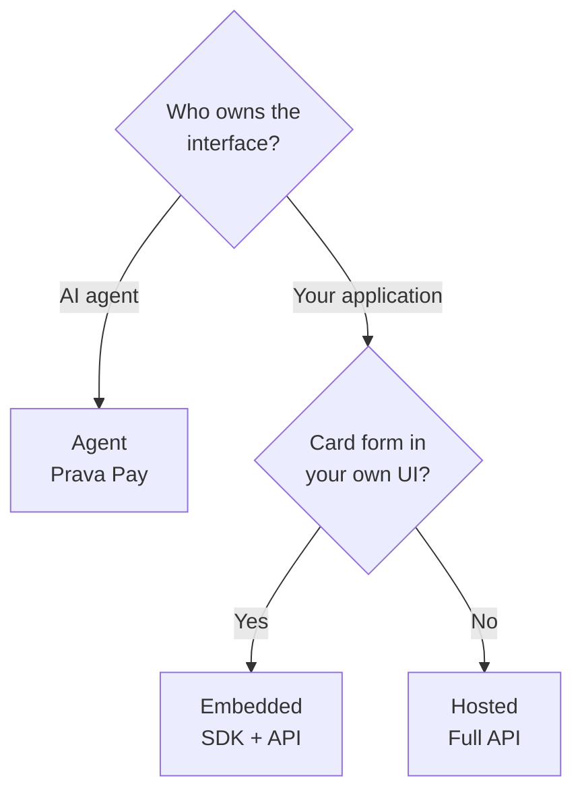

Prava has **three** integration paths. Which one you want comes down to two questions:

1. **Who owns the interface** — an **AI agent**, or your own application?
2. If it's your application, **how do you want to present card entry** — inside your own UI, or hand off
   to a Prava-hosted page?

<Note>
  With Prava the payment itself is **always AI/agent-mediated** — what differs is *who owns the
  interface* and *where the card UI lives*. All three paths share the same secure core: the card is
  entered on Prava's surface and turned into one-time, scoped credentials.
</Note>

## Decide in 10 seconds

<Steps>
<Step title="Is the interface owned by an AI agent?">
  If the surface your user interacts with is an **AI agent platform** (OpenClaw, Hermes, ChatGPT),
  connect Prava as that agent's payment capability — via the **CLI today**, or an **MCP connector
  (coming soon)**. → **[Prava Pay](/prava-pay/overview)**.
</Step>
<Step title="Otherwise, do you want the card form in your own UI?">
  You own an **AI application, or an app backed by a legal business entity**:
  - **Yes** — keep the user on your page → **[Embedded (SDK + API)](/sdk/integration-modes)**.
  - **No** — minimal frontend, redirect out and back → **[Hosted (full API)](/sdk/integration-modes#hosted-mode-default)**.
</Step>
</Steps>

<Note>
  **MCP connector — coming soon.** Prava Pay will also be available as an MCP server you can connect to
  AI apps like Hermes, ChatGPT, and OpenClaw — no CLI required.
</Note>

## Compare the three

| | **Embedded** (SDK + API) | **Hosted** (full API) | **Agent** (Prava Pay) |
|---|---|---|---|
| **Who owns the interface** | Your AI application / business | Your AI application / business | An AI agent platform — OpenClaw, Hermes, ChatGPT |
| **Where the card is entered** | Iframe **inside your page** | Prava-hosted page (redirect) | Prava-hosted page (the owner enters it) |
| **What you build** | Session (backend) + SDK wiring (frontend) | Session (backend) + a redirect & `callback_url` route | The agent runs the `prava` CLI (MCP connector coming soon) |
| **What Prava hosts** | The secure card iframe | The full checkout page | The full checkout + agent control plane |
| **Frontend footprint** | Small JS (`@prava-sdk/core`) | Almost none | None (CLI today · MCP soon) |
| **How you get the result** | `onSuccess` callback, in-app | Redirect to your `callback_url` | CLI output / exit codes |
| **Best when** | You want a native-feeling checkout on your page | You want the fastest, lowest-maintenance integration | The interface is an AI agent that shops or pays |
| **Start here** | [SDK Overview](/sdk/overview) | [API Reference](/api-reference/overview) | [Prava Pay](/prava-pay/overview) |

## Pick your path

<CardGroup cols={3}>
<Card title="Embedded (SDK + API)" icon="window-maximize" href="/sdk/integration-modes">
  Card UI inside your own page. Use when you want checkout to feel native to your product.
</Card>
<Card title="Hosted (Full API)" icon="up-right-from-square" href="/sdk/integration-modes#hosted-mode-default">
  Redirect to a Prava-hosted page. Use when you want to ship fast with minimal frontend code.
</Card>
<Card title="Agent (Prava Pay)" icon="terminal" href="/prava-pay/overview">
  For **AI-agent-owned interfaces**. CLI today; **MCP connector coming soon**.
</Card>
</CardGroup>

<Info>
  Embedded and Hosted are two ways to use the **same session** — see
  [Integration Modes](/sdk/integration-modes) for the mechanics. **Agent** (Prava Pay) is a separate
  product for AI-agent-owned interfaces; start at its [overview](/prava-pay/overview).
</Info>
