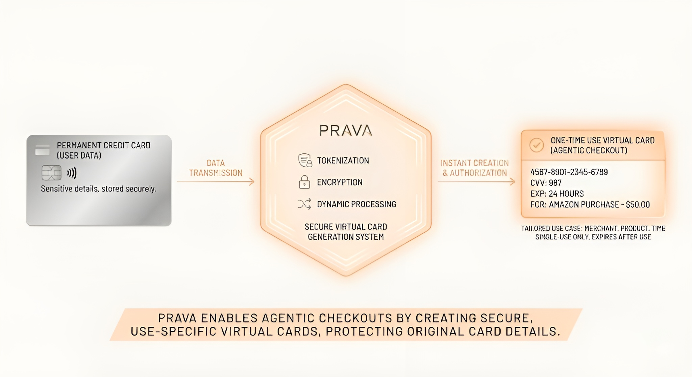

## What Prava Solves

Traditional online checkout requires manual user input. AI apps can help with search and recommendation, but they can’t complete payments without:

- Secure access to card credentials
- Verified user intent
- Trust between agents and merchants
- A standard way to deliver payment payloads

Prava provides these foundations so AI agents can pay on behalf of users safely.

## Developer Mental Model

Think of Prava as a **programmable payment proxy**.

Instead of your AI agent handling raw credit card numbers (which creates massive compliance and security risks), it handles **Intents**—permissions to spend.

1.  **The Agent** requests permission to buy a specific thing.
2.  **The User** grants permission via their device (Passkey).
3.  **Prava** exchanges that permission with the **Card Network** for a one-time, merchant-specific credential.
4.  **The Agent** uses that ephemeral credential to complete the checkout.

This decouples the *agent's ability to buy* from the *user's sensitive data*.

## System Architecture

### 1. The Trust Layer (Identity)

Every AI agent interacting with merchants must be identifiable. Prava issues the agent a secure identity, enabling merchants to validate who is making the request. This establishes a chain of trust:
`User -> Agent -> Prava -> Merchant`.

### 2. The Data Layer (Tokenization)

**Users never expose real card numbers to the agent.**
The card network tokenizes each card. This means the "card" your agent sees is actually a **Network Token (DPAN)**.

*   **Bound to Context**: The token is tied to the user, agent, and specific merchant/product.
*   **One-Time Use**: For every checkout, the agent retrieves a fresh tokenized credential plus a single-use dynamic verification value (cryptogram).

### 3. The Logic Layer (Intent Object)

The **Intent Object** is the programmatic definition of "what is allowed". It captures:

*   **Item details**: Product IDs, Names.
*   **Budget**: The maximum authenticated decline threshold.
*   **Quantity**: How many items.
*   **Timing**: When the purchase can occur (immediately or automated later).
*   **Merchant**: The specific verified recipient.

The network enforces these constraints (Amount & Expiry) at the moment of credential retrieval.

### 4. Security Architecture

*   **Device-Bound Authentication**: Users authenticate instructions with a device-bound passkey (FIDO/WebAuthn). This is set up once per device/card with issuer step-up (e.g., OTP).
*   **Merchant Verification**: Prava validates the merchant to prevent payments to spoofed sites.
*   **HTTPS Enforcement**: Agents can only transact on HTTPS pages with valid certificates and approved domains.

## Technical Implementation Flow

Here is the lifecycle of an agentic payment:

### 1. Credential Provisioning
The app collects card details and sends them to Prava. Prava interacts with the Card Network to tokenize the card and returns a secure reference to the app.

### 2. Authentication & Authorization
When an agent needs to pay, the user must authenticate the instruction.
*   **Mechanism**: Device-bound Passkey.
*   **Scope**: Required for Create, Update, and Cancel of instructions.
*   **Result**: The Intent is now "Authorized" and ready for execution.

### 3. Payload Generation
The agent requests the Checkout Payload from Prava for a specific authorized Intent.
**The Network Returns**:
*   Tokenized Card Number (DPAN)
*   Token Expiry (Month/Year)
*   Single-use Dynamic Verification Value (Cryptogram)

> **Note**: This set of data effectively acts as a "Single Use Card".

### 4. Execution (Checkout)
The agent injects the Checkout Payload into the merchant's flow.
*   **Supported Modes**: Standard guest web checkouts (secure form-fill) & Merchant APIs.
*   **Security Check**: The network enforces merchant and amount controls at authorization using the retrieved credentials.



### 5. Processing
The transaction proceeds through the standard rails:
`Merchant -> Acquirer -> Card Network -> Issuer`

### 6. Reconciliation
**Agent Publishes Confirmation**
After checkout submission, the agent publishes confirmation data (status, amounts, products) back to the Prava network. This is critical for:
*   Reconciliation
*   Fraud Controls
*   Dispute Handling

## Integration Options

### A. Full Prava Agentic SDK (Recommended)
Handles the complex orchestration of tokenization, authentication, intent management, and payload injection.

```javascript
// 1. Define what you want to buy
const order = { item: "xyz", price: 100, merchant: "abc" };

// 2. Create the Intent (triggers User Auth flow)
const intent = await prava.intent.create(order);

// 3. Execute Checkout (fetches credentials & fills form)
const result = await prava.checkout.execute(intent);
```

### B. API-Only Integration
For teams who need granular control, individual endpoints are available for:
*   Tokenization
*   Intent Creation
*   Checkout Payload Generation

## Getting Access

Prava is currently in restricted rollout.

1.  **Onboarding**: [Fill the form](https://www.prava.space/join) (AI App or Merchant).
2.  **Review**: Prava verifies trust & use-case.
3.  **Access**: Get API Keys, Sandbox, and Dashboard within 24h.

## Why Developers Use Prava

*   **Zero PCI Scope**: No sensitive card data exposure.
*   **Global Standard**: Future-proof infrastructure aligned with EMV/Network standards.
*   **Universal Compatibility**: Works with any merchant (No-code to API-first).
*   **Developer Experience**: Single SDK for complex payment orchestration.
