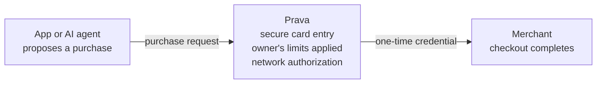

Prava sits between the party that wants to pay (an app or an AI agent) and the merchant. Its job is
to keep the sensitive parts (the real card, the spending rules, the final authorization) out of the
caller's hands, while still letting the payment go through.

## The core idea

An app or agent never holds a real card number. Instead it works with **permission to spend** and, at
the moment of purchase, a **one-time credential** that only works for that exact purchase.

## The lifecycle

<Steps>
<Step title="A purchase is proposed">
  An app creates a **session** for a specific order, or an agent creates a payment for a known
  merchant and total. The amount and merchant are pinned up front.
</Step>
<Step title="The card is collected securely">
  The cardholder enters their card in Prava's secure surface: an embedded iframe (SDK) or a hosted
  page (Prava Pay). The raw card number never reaches the app, the agent, or their servers.
</Step>
<Step title="The owner's rules are applied">
  Prava checks the purchase against the account's guardrails (spending limits, approvals, saved
  addresses) before anything is charged. See [Guardrails](/concepts/guardrails).
</Step>
<Step title="A one-time credential is issued">
  Prava returns credentials scoped to that single purchase: locked to the merchant, the amount, and a
  short time window. They can't be reused or repurposed.
</Step>
<Step title="Checkout completes">
  The credential is used at the merchant's checkout to complete the payment. The outcome is confirmed
  from the payment itself, so the status you get back is the real one.
</Step>
</Steps>

## Why it's safe by design

<CardGroup cols={2}>
<Card title="No raw card exposure" icon="shield-halved">
  The card is entered in Prava's secure surface and tokenized (the number is replaced with a secure
  stand-in). Apps and agents never see it.
</Card>
<Card title="Scoped credentials" icon="lock">
  What the caller receives works for **one** purchase: right merchant, right amount, short-lived.
</Card>
<Card title="Owner-set guardrails" icon="sliders">
  Spending limits and approvals are enforced by Prava on every purchase, not by the caller.
</Card>
<Card title="No silent double-charge" icon="rotate">
  If an outcome is ever uncertain, Prava declines to guess rather than risk charging twice.
</Card>
</CardGroup>

## Three ways to integrate

The same lifecycle powers all three integration paths:

| | [Embedded](/sdk/integration-modes) | [Hosted](/sdk/integration-modes#hosted-mode-default) | [Agent](/prava-pay/overview) |
|---|---|---|---|
| Runs in | Your web app (SDK) | Your backend (API) | An AI agent, via [MCP](/mcp/overview) or the CLI |
| Card entry | Iframe inside your page | Prava-hosted page (redirect) | Prava-hosted page |
| Best for | Native checkout in your product | Fast, minimal-frontend checkout | Agents buying on someone's behalf |

Not sure which to pick? See [Choosing Your Integration](/choosing-your-integration). For the money-side
details (mandates, credential scoping, and status), see [Payments](/concepts/payments). For the
controls an owner sets, see [Guardrails](/concepts/guardrails).
