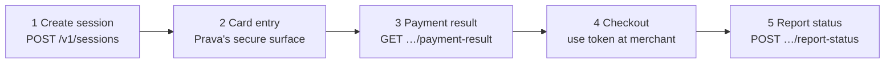

import NeedsPrava from '/snippets/needs-prava.mdx';

## The lifecycle you drive

From your side, a complete payment is **three API calls and one hand-off**. This is the entire public
surface; everything else on this page is what Prava does for you in between:

| Step | What happens | Who does it |
|------|--------------|-------------|
| **1. Session** | Pin the order: customer, merchant, amount, line items | Your backend ([Create Session](/api-reference/create-session)) |
| **2. Card entry** | Cardholder enters the card + approves with a passkey | The user, on Prava's surface (embedded [`collectPAN`](/sdk/cards/collect-pan) or hosted page) |
| **3. Payment result** | Receive the one-time credentials (`token` + `dynamic_cvv`) | Your backend ([Get Payment Result](/api-reference/get-payment-result)) |
| **4. Checkout** | Use the credentials like a normal card at the merchant | Your app / AI agent |
| **5. Report status** | Tell Prava the outcome (`APPROVED` / `DECLINED`) | Your backend ([Report Status](/api-reference/report-status)) |

### How a payment starts: two examples

**Human-in-the-loop (how every payment works today).** A user tells their agent "buy this $34
book from Bookshop". The agent (or your backend) creates a session for exactly $34 at Bookshop.
The user gets Prava's secure surface, enters or picks their card, and approves with a passkey.
Only then does a one-time credential exist, and it works only for $34 at Bookshop. No approval,
no credential, no charge.

**Recurring (planned).** The same shape, approved once: a user will approve "up to $12/month at
this merchant" a single time, and the agent can invoke that mandate monthly within the limits
without a fresh passkey per charge. Until this ships, every mandate is `one_time` and each payment
needs its own approval.

### 1. Session

A **session** is the starting point. Created server-to-server by the merchant using a secret key
(`POST /v1/sessions`), it bundles:

*   **Customer identity**: `user_id`, `user_email`
*   **Order details**: `total_amount`, `currency`, product line items
*   **Merchant context**: merchant name, URL, country code
*   **Purchase context**: product descriptions, unit prices, quantities

The session returns a `session_token` and `iframe_url` used to initialize the SDK on the frontend
(or to redirect the cardholder in hosted mode). Sessions expire after **15 minutes**.

## What Prava does for you in the middle

Between card entry (step 2) and the payment result (step 3), Prava runs the secure machinery below.
**None of it requires an API call from you.** It's described here so you can interpret the states you
see in [payment results](/api-reference/get-payment-result) and understand the guarantees.

### Transactions

A **transaction** represents a single payment attempt within a session. It can be one of two flow types:

| Flow Type | Description |
|-----------|-------------|
| `addCard` | User enrolls a new card and pays in one flow |
| `savedCard` | User pays with a previously enrolled card |

Each transaction is deduplicated using a deterministic idempotency key derived from the order, flow
type, and card fingerprint, so retrying the same request cannot cause a double charge.

**Transaction statuses** (reflected in the [payment result](/api-reference/get-payment-result)):

| Status | Meaning |
|--------|---------|
| `pending` | Transaction created, awaiting authentication |
| `awaiting_result` | Credentials issued; checkout in progress, awaiting your [status report](/api-reference/report-status) |
| `completed` | Payment authorized and completed |
| `failed` | Payment failed (declined, timeout, or error) |

### Authentication (FIDO / Passkey)

Before a payment can be authorized, the user authenticates via **Passkey** (WebAuthn) on Prava's
surface: Prava's backend generates a challenge, and the user confirms via biometric (Touch ID,
Face ID) or security key. The signed assertion proves the user explicitly approved the transaction.

### Mandates

A **mandate** is a card-network-level spending permission. Once the user authenticates, Prava
registers a mandate with the card network that specifies:

*   **Merchant**: who can charge the card
*   **Amount threshold**: maximum per-transaction amount
*   **Frequency**: currently `one_time` (recurring frequencies are planned)
*   **Effective duration**: how long the mandate remains active (`effective_until_minutes`, default 15)

Each mandate also carries **line items** (product IDs, descriptions, unit prices, quantities) that
break down the purchase at a product level; the amount threshold and quantity limit apply at the
**mandate level**, not per line item.

**Mandate statuses** (surfaced in payment results and status reports):

| Status | Meaning |
|--------|---------|
| `pending` | Created, awaiting network confirmation |
| `active` | Live and usable for payment token generation |
| `consumed` | Fully used (all allowed invocations exhausted) |
| `cancelled` | Revoked by user or system |
| `expired` | Past its effective date |

### Payment tokens — the credential you receive

Against an active mandate, Prava generates **payment tokens**: a virtual card number (PAN), expiry,
and CVV, scoped to the mandate constraints. These are what step 3 hands back to you:

*   **Single-use**: each token can only be used once
*   **Merchant-locked & amount-scoped**: enforced at the network level and by Prava; transactions
    outside the mandate are declined
*   **Short-lived**: use tokens promptly after they're issued

<Tip>
  Same credential, different names: the API calls these `token` + `dynamic_cvv`; the Prava Pay CLI
  prints `Token` + `Cryptogram`. See the [Glossary](/concepts/glossary).
</Tip>

## Merchant Network & Shopify App

Prava integrates with merchant platforms and card networks to complete payments. The **Prava Shopify
app** is available by invite:

<NeedsPrava />

## Settlement & Refunds

*   **Settlement** follows standard card network flows. Prava supports multiple settlement models; details are confirmed during merchant onboarding.
*   **Refunds** follow standard refund flows and can be issued through the API.
*   **Disputes** are routed to the responsible parties as per the settlement agreement.
