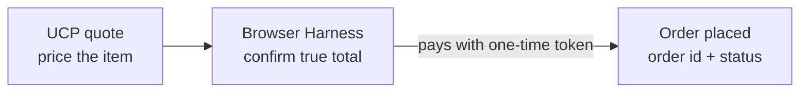

The **Browser Harness** is the second half of the agentic-commerce pipeline: it **starts from a
[UCP](/integration/ucp) quote** and turns that estimate into a placed, verified order. Most merchants
don't expose a direct payment API, so to actually place an order, someone has to go through the
merchant's own checkout. The Browser Harness does exactly that: it drives the real Shopify checkout,
works out the true final total, and pays with the one-time tokenized card (a single-use stand-in
for the real card). An AI application completes the purchase without ever touching the raw card or
the merchant's checkout code.

<Note>
  The Browser Harness is the **checkout** step after a UCP [quote](/integration/ucp). It powers
  [`prava shop checkout`](/prava-pay/shopping#checkout) and hosted agentic purchases.
</Note>

## What it does

<CardGroup cols={2}>
<Card title="Completes the real checkout" icon="cart-shopping">
  Fills the merchant's checkout (contact, shipping address, delivery option) and submits payment with
  the one-time token. No merchant integration required.
</Card>
<Card title="Confirms the true total first" icon="scale-balanced">
  Reconciles subtotal, shipping, and tax against the live checkout and waits for the amount to settle
  **before** charging, so there are no surprise totals.
</Card>
<Card title="Returns a verifiable result" icon="receipt">
  On success you get an **order id** and a payment **status**: a checkable confirmation the order was
  placed.
</Card>
<Card title="Reliable, repeatable" icon="arrows-rotate">
  It learns a merchant's checkout on the first run and completes later runs consistently, healing
  automatically if the page changes.
</Card>
</CardGroup>

## Why it matters

<Steps>
<Step title="No surprise charges">
  The amount is **reconciled and stable** before payment is attempted. If the total shifts mid-checkout
  (late shipping, tax, or add-ons), reconciliation restarts rather than charging the wrong amount.
</Step>
<Step title="One clean attempt">
  A checkout runs as a single, tracked flow rather than a blind retry loop, so a purchase either
  completes and returns an order, or fails cleanly for you to re-quote.
</Step>
<Step title="Card safety preserved">
  It pays with the **single-use, merchant-scoped** credential from the session. Even inside the
  checkout, the credential can't be reused or redirected to another merchant.
</Step>
</Steps>

## How it fits the flow

The [UCP](/integration/ucp) quote gives an estimate; the Browser Harness turns it into a **completed,
verified order**. Today it targets **Shopify** checkouts.

## Next

<CardGroup cols={2}>
<Card title="UCP" icon="magnifying-glass" href="/integration/ucp">
  How products are discovered and quoted before checkout.
</Card>
<Card title="Agentic Commerce" icon="plug" href="/integration/overview">
  The full discover → quote → checkout → pay pipeline.
</Card>
</CardGroup>
