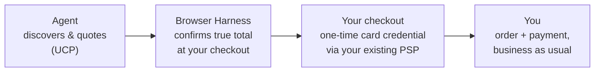

import NeedsPrava from '/snippets/needs-prava.mdx';

Agents paying with Prava look like **normal card customers** to you. This page tells you what works
today with no integration at all, and what to ask Prava for if you want more.

## Works today — zero changes on your end

<CardGroup cols={2}>
<Card title="Accepting agent payments" icon="credit-card">
  Prava's payment tokens are real card credentials: they work at any standard checkout through your
  existing payment service provider, or PSP (Stripe, Braintree, Adyen, custom). Nothing to install,
  nothing to change.
</Card>
<Card title="Shopify stores via UCP + Harness" icon="cart-shopping">
  If you're a Shopify store advertising [UCP](/integration/ucp) (Shopify's protocol that lets agents
  shop a store), agents can already discover your products, get quotes, and complete checkout via
  the [Browser Harness](/integration/browser-harness). No setup on your end.
</Card>
</CardGroup>

Payments arrive through your normal card/acquirer flow: you stay merchant-of-record, refunds and
disputes work exactly as they do today. Details: [FAQs](/integration/faqs).

## By request — email us

Two things are currently provisioned by Prava per merchant:

| What | Why you'd want it | How to get it |
|------|-------------------|---------------|
| **Prava Shopify app** (direct integration, invite-only) | Native order attribution and richer agent checkout on your Shopify store | Request "Shopify app onboarding" |
| **Settlement model confirmation** | Confirmed during merchant onboarding | Ask when onboarding |

<NeedsPrava />

When you write, include: your store name and URL, your platform (Shopify or other), and roughly the
volume of agent-driven orders you expect. That's everything we need to start.

## How an agent purchase reaches you

The credential the agent pays with is **single-use, locked to you, and amount-scoped**: an agent
can't reuse it elsewhere or change the total after you quoted it.

## Next

<CardGroup cols={2}>
<Card title="Agentic Commerce overview" icon="plug" href="/integration/overview">
  The full discover → quote → checkout → pay pipeline.
</Card>
<Card title="Merchant FAQs" icon="question" href="/integration/faqs">
  MoR, refunds, disputes, security, supported currencies.
</Card>
</CardGroup>
