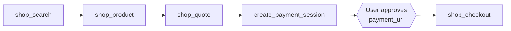

The server exposes 12 tools. Your MCP client discovers them automatically; this page is the map of
what they do and how they chain together.

## The buy-flow chain

To buy a product, tools must run in this order. The key rule: `create_payment_session` authorizes
payment but never places an order. Only `shop_checkout` buys.

1. `shop_search` finds products. `shop_product` gets the exact variant.
2. `shop_quote` locks a live total and returns a `checkout_session_id`.
3. `create_payment_session` for that exact total returns a `payment_url`.
4. The user opens the `payment_url` and approves with their passkey (a biometric confirmation on
   their device).
5. `shop_checkout` places the order. Credentials stay server-side.

Paying a known total at a named merchant (a bill, an invoice, a checkout the user is already on)
skips discovery: `create_payment_session` → user approves → done.

## Payments

### create_payment_session — `checkout:run`

Creates a payment session and returns a `payment_url` for the user to approve. Charges nothing by
itself.

| Parameter | Type | Notes |
|-----------|------|-------|
| `total_amount` | string, required | Decimal string, e.g. `"49.99"` |
| `currency` | string, required | 3-letter ISO 4217, e.g. `USD` |
| `merchant_name` | string, required | Display name shown to the user |
| `merchant_url` | string, required | Merchant website URL |
| `merchant_country` | string, required | 2-letter ISO 3166-1, e.g. `US` |
| `products` | array, required | Line items: `{ description, unit_price, quantity? }` |
| `idempotency_key` | string, optional | Same key returns the original session instead of a duplicate |

Returns `{ session_id, payment_url, expires_at, replayed }`.

### get_payment_status — `payments:read`

Checks a payment session. Returns **status only**: `pending`, `completed`, `failed`, or `not_found`.
Payment credentials never leave the gateway.

| Parameter | Type | Notes |
|-----------|------|-------|
| `session_id` | string, required | From `create_payment_session` |

## Shopping

### shop_search — `payments:read`

| Parameter | Type | Notes |
|-----------|------|-------|
| `query` | string, required | e.g. `"running shoes size 10"` |
| `merchant` | string, optional | Merchant domain to scope the search |
| `cursor` | string, optional | Pagination cursor from a prior search |

Returns product listings: `product_id`, price estimate, merchant.

### shop_product — `payments:read`

| Parameter | Type | Notes |
|-----------|------|-------|
| `product_id` | string, required | From `shop_search` |
| `merchant` | string, optional | Merchant domain from the search result |

Returns purchasable offers and variants: `variant_id`, price, availability.

### shop_quote — `payments:write`

Opens a checkout and locks a live price. Requires a delivery address on file (check with
`shop_list_addresses`).

| Parameter | Type | Notes |
|-----------|------|-------|
| `variant_id` | string, required | From `shop_product` |
| `merchant` | string, required | Merchant domain from that offer |
| `quantity` | number, optional | Defaults to 1 |
| `address_id` | string, optional | Defaults to your default address |

Returns `checkout_session_id` plus the exact total to pay.

### shop_checkout — `checkout:run`

The required final step. Places the order for a prior quote, paying with an **approved** payment
session. The session's amount must match the quote total.

| Parameter | Type | Notes |
|-----------|------|-------|
| `checkout_session_id` | string, required | From `shop_quote` |
| `payment_session_id` | string, required | An approved session from `create_payment_session` |

Returns `{ status, order_id, amount, replayed }`. If the payment isn't approved yet, the tool says
so; poll `get_payment_status` until `completed`, then retry.

## Addresses

Address reads are masked. Full address details stay server-side and go only to the merchant.

### shop_list_addresses — `payments:read`

No parameters. Returns masked summaries (id, label, short summary, which is default) plus whether a
contact phone is on file.

### shop_add_address — `payments:write`

| Parameter | Type | Notes |
|-----------|------|-------|
| `first_name`, `last_name` | string, required | |
| `street` | string, required | Line 1; `street2` optional |
| `city`, `region`, `postal_code` | string, required | |
| `country` | string, required | 2-letter ISO 3166-1 |
| `label` | string, optional | e.g. `"Home"` |
| `phone` | string, optional | Contact phone, saved to the profile |
| `set_default` | boolean, optional | Make this the default |

### shop_set_default_address — `payments:write`

| Parameter | Type | Notes |
|-----------|------|-------|
| `address_id` | string, required | From `shop_list_addresses` |

## Account

### list_cards — `payments:read`

No parameters. Returns the user's saved cards, masked: last4, brand, expiry. Never full numbers.

### list_agents — `payments:read`

No parameters. Returns the user's connected agents, including this connection.

### ping — no scope

Health probe. Returns `{ pong: true }` and the server time. Use it to confirm the connection after
[setup](/mcp/connect).
