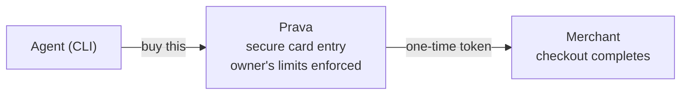

import Portals from '/snippets/portals.mdx';

_Not sure this is the right path? See [Choosing Your Integration](/choosing-your-integration)._

**Prava Pay** lets an AI agent (Claude Code, Cursor, Codex, or any coding agent) make real
purchases on a person's behalf. This section covers the **CLI**: a single command-line tool,
`@prava-sdk/cli`, that the agent runs directly. No servers to stand up, no card data to handle.

<Note>
  Agent platform supports MCP? MCP is the standard protocol for giving an agent tools. You may not
  need the CLI at all: connect via the [Prava MCP](/mcp/overview) instead (one URL, same account
  and guardrails).
</Note>

<Card title="Who Prava Pay is for" icon="robot">
  Builders of autonomous or human-in-the-loop agents that need to **buy something** (order a
  product, pay a merchant, complete a checkout) without ever touching a raw card number.
</Card>

## How it fits together

Prava Pay sits between the agent and the merchant. The agent describes *what* it wants to buy;
Prava handles the sensitive parts: collecting the card, issuing **one-time, merchant-scoped
credentials**, and completing the payment.



The person who owns the account (the **agent owner**) stays in control the whole time:

- They **link and approve** an agent once, from their browser. An unapproved agent can do nothing.
- They **enter card details themselves** in Prava's secure page. The agent never sees the real card.
- They set the **guardrails** (spending limits, saved addresses) that Prava enforces on every purchase.

The owner does all of this from the **Prava Pay dashboard** at [pay.prava.space](https://pay.prava.space):

<Portals />

<Note>
  The agent only ever receives a **one-time payment credential** scoped to a single, already-priced
  purchase. It cannot reuse it, change the amount, or pay a different merchant.
</Note>

## The two ways to pay

Prava Pay supports two flows, depending on how much the agent needs to do:

<CardGroup cols={2}>
<Card title="Direct payment" icon="credit-card" href="/prava-pay/sessions">
  You already know the merchant, items, and total. Create a **payment session**, the owner enters
  the card, and you receive credentials to complete checkout. See [Payment sessions](/prava-pay/sessions).
</Card>

<Card title="Agentic shopping" icon="cart-shopping" href="/prava-pay/shopping">
  The agent **discovers** the product too: search across merchants, compare offers, get a live
  quote, then pay. See [Agentic shopping](/prava-pay/shopping).
</Card>
</CardGroup>

## Install

Prava Pay is a global CLI. The **owner** installs it once on the machine the agent runs on:

```bash
npm install -g @prava-sdk/cli
```

Verify the install:

```bash
prava --version
# 3.0.3
```

<Warning>
  Always install the CLI **yourself** as the owner. Don't have the agent install or update it
  silently: installation is a trust action, and keeping it explicit keeps you in the loop.
</Warning>

Alongside the CLI, install the matching **skill** so the agent knows which command to run when:

```bash
npx --yes skills add https://github.com/Prava-Payments/prava-skills \
  --skill prava-shopping --global --yes --full-depth
```

## Guided by Skills

The CLI does the work; **Skills guide the agent on _which_ command to call and _when_.** A skill encodes
the correct flow, paces the agent (one decision per turn), and forces a confirmation before any
spend, keeping the human in control. The CLI runs without a skill, but will nudge you to install one
if it's missing.

- **`prava-pay`** pays for a known item: `setup` → `sessions create` → `poll` → checkout.
- **`prava-shopping`** finds *and* buys: `search` → `product` → `quote` → `checkout`.

See **[Skills](/prava-pay/skills)** for the full list, install commands, and how they keep the agent
safe.

## What you'll do next

<Steps>
<Step title="Link the agent">
  Run `prava setup`, approve the agent in your browser, and confirm the link. See
  [Linking an agent](/prava-pay/linking).
</Step>
<Step title="Make a purchase">
  Create a payment session (or shop for a product), enter your card, and let the agent complete
  the checkout. See the [Quickstart](/prava-pay/quickstart).
</Step>
<Step title="Handle the unexpected">
  Know what each message means and how to recover. See [Troubleshooting](/prava-pay/troubleshooting).
</Step>
</Steps>

## Prava Pay vs. the Prava SDK

Prava Pay (CLI) and the [Prava SDK](/sdk/overview) solve different problems:

| | **Prava Pay (CLI)** | **Prava SDK** |
|---|---|---|
| Runs where | On the agent's machine | In a merchant's web app |
| Audience | AI agents & their owners | Merchants embedding Prava at checkout |
| Card entry | Owner enters it in Prava's page | Shopper enters it in an embedded iframe |
| You get | A tool the agent calls | A JS library ([`collectPAN`](/sdk/cards/collect-pan)) |

They share the same secure backbone. Pick Prava Pay when the **interface is owned by an AI agent**.
