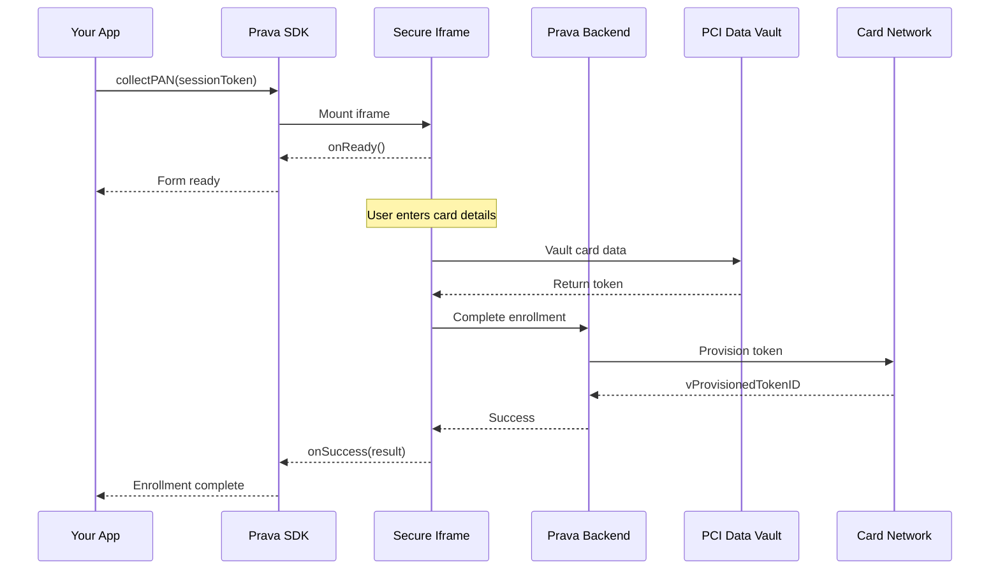

## Overview

The `collectPAN()` method securely collects credit card details from users through an isolated iframe. The card data is tokenized via PCI Data Vault and provisioned with card network, ensuring PCI compliance without card data ever touching your servers.

## Method Signature

```typescript
prava.collectPAN(options: CollectPANOptions): Promise<CollectPANResult>
```

## Parameters

<ParamField path="options" type="CollectPANOptions" required>
  Configuration options for card collection

  <Expandable title="properties">
    <ParamField path="sessionToken" type="string" required>
      Session token obtained from your backend via `POST /v1/sessions`
    </ParamField>

    <ParamField path="container" type="string" required>
      CSS selector for the iframe container element (e.g., `#card-form`)
    </ParamField>

    <ParamField path="onReady" type="() => void">
      Callback fired when the iframe is loaded and ready for input
    </ParamField>

    <ParamField path="onChange" type="(state: CardValidationState) => void">
      Callback fired when card input validation state changes
    </ParamField>

    <ParamField path="onSuccess" type="(result: CollectPANResult) => void">
      Callback fired when card collection completes successfully
    </ParamField>

    <ParamField path="onError" type="(error: PravaError) => void">
      Callback fired when an error occurs
    </ParamField>

    <ParamField path="styles" type="object">
      Custom CSS styles for the iframe form fields
    </ParamField>
  </Expandable>
</ParamField>

## Return Value

<ResponseField name="result" type="CollectPANResult">
  <Expandable title="properties">
    <ResponseField name="enrollment_id" type="string">
      Unique identifier for this card enrollment
    </ResponseField>

    <ResponseField name="card_last4" type="string">
      Last 4 digits of the card number
    </ResponseField>

    <ResponseField name="card_brand" type="string">
      Card brand (visa, mastercard, amex, discover)
    </ResponseField>

    <ResponseField name="card_exp_month" type="number">
      Card expiration month (1-12)
    </ResponseField>

    <ResponseField name="card_exp_year" type="number">
      Card expiration year (4 digits)
    </ResponseField>

    <ResponseField name="vProvisionedTokenID" type="string">
      Card network provisioned token identifier
    </ResponseField>
  </Expandable>
</ResponseField>

## Example

<CodeGroup>
```typescript React
import { useState } from 'react';
import { PravaSDK } from '@prava/sdk-core';

function CardEnrollment() {
  const [loading, setLoading] = useState(false);
  const [sessionToken, setSessionToken] = useState<string | null>(null);

  const prava = new PravaSDK({
    publishableKey: 'pk_sandbox_your_key',
    environment: 'sandbox'
  });

  // Get session token from your backend
  useEffect(() => {
    fetch('/api/create-session', { method: 'POST' })
      .then(r => r.json())
      .then(data => setSessionToken(data.session_token));
  }, []);

  const handleCollect = async () => {
    if (!sessionToken) return;

    setLoading(true);
    
    try {
      const result = await prava.collectPAN({
        sessionToken,
        container: '#card-form',
        onReady: () => {
          console.log('Form ready');
        },
        onChange: (state) => {
          console.log('Validation:', state);
        },
        onSuccess: (data) => {
          console.log('Card enrolled:', data.card_last4);
          // Navigate to success page or next step
        },
        onError: (error) => {
          console.error('Error:', error);
          setLoading(false);
        }
      });
    } catch (error) {
      console.error('Collection failed:', error);
      setLoading(false);
    }
  };

  return (
    <div>
      <div id="card-form"></div>
      <button onClick={handleCollect} disabled={loading || !sessionToken}>
        {loading ? 'Processing...' : 'Add Card'}
      </button>
    </div>
  );
}
```

```typescript Vanilla JavaScript
const prava = new PravaSDK({
  publishableKey: 'pk_sandbox_your_key',
  environment: 'sandbox'
});

// Get session token from backend
const sessionToken = await fetch('/api/create-session', {
  method: 'POST'
}).then(r => r.json()).then(d => d.session_token);

// Collect card
const result = await prava.collectPAN({
  sessionToken: sessionToken,
  container: '#card-form',
  onReady: () => {
    console.log('Ready for input');
  },
  onChange: (state) => {
    console.log('Card valid:', state.valid);
  },
  onSuccess: (data) => {
    alert(`Card ending in ${data.card_last4} added successfully!`);
  },
  onError: (error) => {
    alert(`Error: ${error.message}`);
  }
});
```
</CodeGroup>

## Flow Diagram



## Under the Hood

When you call `collectPAN()`, here's what happens:

<Steps>
<Step title="Iframe Injection">
The SDK injects a secure, isolated iframe into your specified container. The iframe is served from Prava's domain to ensure zero PCI scope.
</Step>

<Step title="Session Validation">
The iframe validates the session token with Prava's backend to ensure the request is legitimate and not expired.
</Step>

<Step title="User Input">
The user enters their card details (number, expiry, CVV, name) in the iframe form with real-time validation.
</Step>

<Step title="PCI Data Vault Vaulting">
When the user submits, the iframe sends the card data directly to PCI Data Vault for tokenization. Your servers never see the raw PAN.
</Step>

<Step title="Card Network Provisioning">
Prava's backend retrieves the encrypted payment instrument from PCI Data Vault and provisions a token with card network, binding it to the user's device via FIDO.
</Step>

<Step title="Result">
The enrollment result (with `last4`, `brand`, `vProvisionedTokenID`) is returned to your app.
</Step>
</Steps>

## Validation States

The `onChange` callback receives a `CardValidationState` object:

```typescript
interface CardValidationState {
  valid: boolean;
  errors: {
    cardNumber?: string;
    expiry?: string;
    cvv?: string;
    name?: string;
  };
}
```

## Error Handling

<ResponseField name="error" type="PravaError">
  <Expandable title="properties">
    <ResponseField name="code" type="string">
      Error code (e.g., `SESSION_EXPIRED`, `INVALID_CARD`, `NETWORK_ERROR`)
    </ResponseField>

    <ResponseField name="message" type="string">
      Human-readable error message
    </ResponseField>

    <ResponseField name="details" type="object">
      Additional error context
    </ResponseField>
  </Expandable>
</ResponseField>

### Common Errors

| Code | Cause | Resolution |
|------|-------|------------|
| `SESSION_EXPIRED` | Session token expired (15 min) | Create new session |
| `SESSION_INVALID` | Invalid or tampered session token | Verify backend logic |
| `INVALID_CARD` | Card failed Luhn check or format | User re-enters card |
| `CARD_DECLINED` | Issuer declined enrollment | User tries different card |
| `NETWORK_ERROR` | Connection issue | Retry after delay |

## Security Notes

<Warning>
**Never** attempt to bypass the iframe or collect card data directly. This breaks PCI compliance and exposes your infrastructure to liability.
</Warning>

<Note>
The iframe uses Content Security Policy (CSP), Subresource Integrity (SRI), and strict origin validation to prevent XSS and data exfiltration.
</Note>

## Next Steps

<CardGroup cols={2}>
<Card title="List Cards" icon="list" href="/sdk/cards/list-cards">
  Retrieve enrolled cards for a user
</Card>

<Card title="Register Intent" icon="bolt" href="/sdk/intents/register">
  Create payment intents with enrolled cards
</Card>
</CardGroup>
