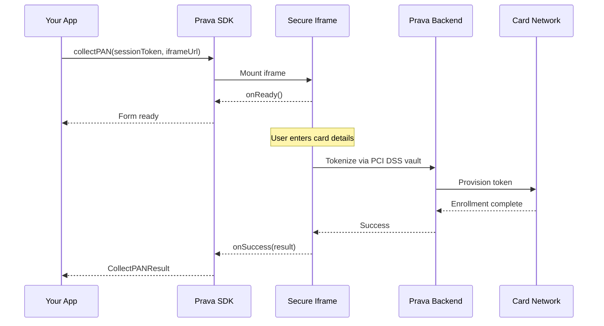

## Overview

The `collectPAN()` method securely collects credit card details from users through an isolated iframe. The card data is tokenized via Prava's PCI DSS vault and returns only safe metadata — your servers never see the raw PAN.

## Method Signature

```typescript
prava.collectPAN(options: CollectPANOptions): Promise<CollectPANResult>
```

## Parameters

<ParamField path="options" type="CollectPANOptions" required>
  Configuration options for card collection

  <Expandable title="properties">
    <ParamField path="sessionToken" type="string" required>
      Session token obtained from your backend
    </ParamField>

    <ParamField path="iframeUrl" type="string" required>
      Iframe URL from your backend session response
    </ParamField>

    <ParamField path="container" type="string | HTMLElement" required>
      CSS selector or DOM element to mount the card form (e.g., `#card-form`)
    </ParamField>

    <ParamField path="onReady" type="() => void">
      Called when the iframe is loaded and ready for input
    </ParamField>

    <ParamField path="onChange" type="(state: CardValidationState) => void">
      Real-time validation state on every keystroke
    </ParamField>

    <ParamField path="onSuccess" type="(result: CollectPANResult) => void">
      Called on successful card enrollment
    </ParamField>

    <ParamField path="onError" type="(error: PravaError) => void">
      Called on error
    </ParamField>

    <ParamField path="styles" type="CardFormStyles">
      Custom styles for the card form
    </ParamField>
  </Expandable>
</ParamField>

## Return Value

<ResponseField name="result" type="CollectPANResult">
  <Expandable title="properties">
    <ResponseField name="enrollmentId" type="string">
      Unique card identifier (use this for intents)
    </ResponseField>

    <ResponseField name="last4" type="string">
      Last 4 digits of the card number
    </ResponseField>

    <ResponseField name="brand" type="string">
      Card brand (`visa`, etc.)
    </ResponseField>

    <ResponseField name="expMonth" type="number">
      Card expiration month (1-12)
    </ResponseField>

    <ResponseField name="expYear" type="number">
      Card expiration year (4 digits)
    </ResponseField>
  </Expandable>
</ResponseField>

## Example

<CodeGroup>
```typescript React
import { useEffect, useRef, useState } from 'react';
import { PravaSDK } from '@prava-sdk/core';
import type { CollectPANResult } from '@prava-sdk/core';

function CardEnrollment({ session }: { session: { session_token: string; iframe_url: string } }) {
  const containerRef = useRef<HTMLDivElement>(null);
  const sdkRef = useRef<PravaSDK | null>(null);
  const [enrolled, setEnrolled] = useState<CollectPANResult | null>(null);

  useEffect(() => {
    const sdk = new PravaSDK({ publishableKey: 'pk_live_xxx' });
    sdkRef.current = sdk;
    return () => sdk.destroy();
  }, []);

  const handleEnroll = async () => {
    if (!sdkRef.current || !containerRef.current) return;

    const result = await sdkRef.current.collectPAN({
      sessionToken: session.session_token,
      iframeUrl: session.iframe_url,
      container: containerRef.current,
      onReady: () => console.log('Form loaded'),
      onChange: (state) => {
        console.log('Complete:', state.isComplete);
      },
      onSuccess: (data) => {
        console.log(`Enrolled: •••• ${data.last4}`);
        setEnrolled(data);
      },
      onError: (err) => console.error(err.code, err.message),
    });
  };

  return (
    <div>
      <div ref={containerRef} />
      <button onClick={handleEnroll}>Enroll Card</button>
      {enrolled && <p>Card enrolled: {enrolled.brand} •••• {enrolled.last4}</p>}
    </div>
  );
}
```

```typescript Vanilla JavaScript
import { PravaSDK } from '@prava-sdk/core';

const prava = new PravaSDK({ publishableKey: 'pk_live_xxx' });

// Get session from your backend
const session = await fetch('/api/session').then(r => r.json());

// Collect card via secure iframe
const card = await prava.collectPAN({
  sessionToken: session.session_token,
  iframeUrl: session.iframe_url,
  container: '#card-form',
  onReady: () => console.log('Form loaded'),
  onChange: (state) => {
    document.getElementById('submit-btn').disabled = !state.isComplete;
  },
  onSuccess: (data) => {
    console.log(data.enrollmentId, data.last4, data.brand);
  },
  onError: (err) => console.error(err.code, err.message),
});
```
</CodeGroup>

```html
<div id="card-form"></div>
<button id="submit-btn" disabled>Enroll Card</button>
```

## Flow Diagram



## Under the Hood

When you call `collectPAN()`, here's what happens:

<Steps>
<Step title="Iframe Injection">
The SDK injects a secure, sandboxed iframe into your specified container. The iframe is served from Prava's domain — card data never touches your DOM or servers.
</Step>

<Step title="Session Validation">
The iframe validates the session token with Prava's backend to ensure the request is legitimate and not expired.
</Step>

<Step title="User Input">
The user enters their card details (number, expiry, CVV) in the iframe form with real-time validation.
</Step>

<Step title="PCI DSS Vaulting">
When the user submits, the iframe tokenizes the PAN via Prava's PCI DSS vault. Your servers never see the raw card number.
</Step>

<Step title="Result">
The enrollment result (with `enrollmentId`, `last4`, `brand`, `expMonth`, `expYear`) is returned to your app.
</Step>
</Steps>

## Validation States

The `onChange` callback receives a `CardValidationState` object on every keystroke:

```typescript
interface CardValidationState {
  cardNumber: FieldState;
  expiry: FieldState;
  cvv: FieldState;
  isComplete: boolean; // true when all fields are valid
}

interface FieldState {
  isEmpty: boolean;
  isValid: boolean;
  isFocused: boolean;
  error?: string;
}
```

Use `isComplete` to enable/disable your submit button:

```typescript
onChange: (state) => {
  submitButton.disabled = !state.isComplete;
}
```

## Error Handling

### Common Errors

| Code | Cause | Resolution |
|------|-------|------------|
| `SDK_ALREADY_ACTIVE` | `collectPAN` called while another session is active | Call `destroy()` first |
| `INVALID_CONFIG` | Missing `iframeUrl` or `publishableKey` | Check your config |
| `IFRAME_LOAD_ERROR` | Iframe failed to load | Check network, verify `iframeUrl` |
| `CARD_NOT_FOUND` | Card ID doesn't exist or was removed | Re-enroll or use a different card |

## Security Notes

<Warning>
**Never** attempt to bypass the iframe or collect card data directly. The iframe is sandboxed with `allow-scripts allow-same-origin allow-forms allow-popups` — minimal permissions. Card data never touches your DOM, JS, or servers.
</Warning>

<Note>
PostMessage communication is origin-locked. The iframe resolves its backend from its own hostname — merchants cannot inject a fake backend URL.
</Note>

## Next Steps

<CardGroup cols={2}>
<Card title="List Cards" icon="list" href="/sdk/cards/list-cards">
  Retrieve enrolled cards for a user
</Card>

<Card title="Register Intent" icon="bolt" href="/sdk/intents/register">
  Create payment intents with enrolled cards
</Card>
</CardGroup>
