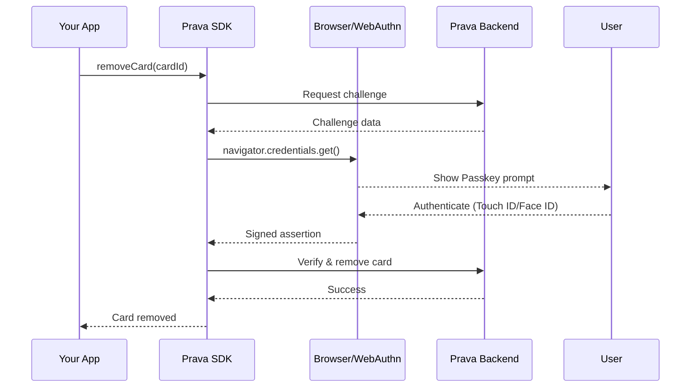

## Overview

The `removeCard()` method permanently deletes an enrolled card. This operation **requires Passkey authentication** to prevent unauthorized card removal.

<Warning>
This action is **irreversible**. Once removed, the card must be re-enrolled to be used again.
</Warning>

## Method Signature

```typescript
prava.removeCard(cardId: string, options?: RemoveCardOptions): Promise<void>
```

## Parameters

<ParamField path="cardId" type="string" required>
  Unique identifier of the card to remove (from `listCards()`)
</ParamField>

<ParamField path="options" type="RemoveCardOptions">
  Optional configuration

  <Expandable title="properties">
    <ParamField path="sessionToken" type="string">
      Session token for the authenticated user
    </ParamField>

    <ParamField path="reason" type="string">
      Optional reason for removal (for audit logs)
    </ParamField>
  </Expandable>
</ParamField>

## Return Value

Returns a `Promise<void>` that resolves when the card is successfully removed.

## Example

<CodeGroup>
```typescript React
import { useState } from 'react';
import { PravaSDK } from '@prava/sdk-core';

function CardItem({ card }) {
  const [removing, setRemoving] = useState(false);

  const prava = new PravaSDK({
    publishableKey: 'pk_sandbox_your_key',
    environment: 'sandbox'
  });

  async function handleRemove() {
    if (!confirm(`Remove card ending in ${card.last4}?`)) {
      return;
    }

    setRemoving(true);

    try {
      // This will trigger Passkey authentication
      await prava.removeCard(card.id, {
        reason: 'User requested removal'
      });

      alert('Card removed successfully');
      window.location.reload(); // Refresh card list
    } catch (error) {
      if (error.code === 'PASSKEY_CANCELLED') {
        alert('Card removal cancelled');
      } else {
        alert(`Failed to remove card: ${error.message}`);
      }
    } finally {
      setRemoving(false);
    }
  }

  return (
    <div className="card-item">
      <span>{card.brand} •••• {card.last4}</span>
      <button 
        onClick={handleRemove} 
        disabled={removing}
        className="btn-danger"
      >
        {removing ? 'Removing...' : 'Remove'}
      </button>
    </div>
  );
}
```

```typescript Node.js
const prava = new PravaSDK({
  publishableKey: 'pk_sandbox_your_key',
  environment: 'sandbox'
});

// Remove a card
try {
  await prava.removeCard('card_abc123', {
    reason: 'Card expired'
  });
  console.log('Card removed successfully');
} catch (error) {
  console.error('Failed to remove card:', error);
}
```
</CodeGroup>

## Passkey Authentication Flow

When you call `removeCard()`, the SDK automatically triggers a Passkey authentication challenge:



<Note>
The Passkey prompt will show the user which card they're removing and ask for biometric or PIN confirmation.
</Note>

## Use Cases

### User-Initiated Removal

Let users manage their own cards:

```typescript
function CardManagement() {
  const [cards, setCards] = useState([]);

  async function handleRemove(cardId) {
    try {
      await prava.removeCard(cardId);
      setCards(cards.filter(c => c.id !== cardId));
    } catch (error) {
      if (error.code === 'PASSKEY_CANCELLED') {
        // User cancelled, do nothing
        return;
      }
      showError(error.message);
    }
  }

  return (
    <div>
      {cards.map(card => (
        <CardItem
          key={card.id}
          card={card}
          onRemove={() => handleRemove(card.id)}
        />
      ))}
    </div>
  );
}
```

### Security Breach Response

Remove all cards in case of a security incident:

```typescript
async function removeAllCards() {
  const cards = await prava.listCards(sessionToken);
  
  const confirmed = confirm(
    `Remove all ${cards.length} card(s)? This action cannot be undone.`
  );

  if (!confirmed) return;

  const results = await Promise.allSettled(
    cards.map(card => prava.removeCard(card.id, {
      reason: 'Security precaution'
    }))
  );

  const removed = results.filter(r => r.status === 'fulfilled').length;
  const failed = results.filter(r => r.status === 'rejected').length;

  alert(`Removed ${removed} card(s). ${failed} failed.`);
}
```

## Error Handling

<ResponseField name="error" type="PravaError">
  <Expandable title="properties">
    <ResponseField name="code" type="string">
      Error code
    </ResponseField>

    <ResponseField name="message" type="string">
      Error description
    </ResponseField>
  </Expandable>
</ResponseField>

### Common Errors

| Code | Cause | Resolution |
|------|-------|------------|
| `PASSKEY_CANCELLED` | User cancelled authentication | Allow user to retry |
| `PASSKEY_FAILED` | Biometric verification failed | Ask user to retry |
| `PASSKEY_NOT_AVAILABLE` | Device doesn't support Passkey | Use fallback auth method |
| `CARD_NOT_FOUND` | Card ID doesn't exist | Refresh card list |
| `CARD_IN_USE` | Card has pending transactions | Wait for transactions to settle |
| `SESSION_EXPIRED` | Session token expired | Create new session |

## Default Card Handling

If the removed card was the default, the next available card becomes default:

```typescript
async function removeCardSafely(cardId) {
  const cards = await prava.listCards(sessionToken);
  const cardToRemove = cards.find(c => c.id === cardId);

  if (cardToRemove?.is_default && cards.length > 1) {
    // Warn user that another card will become default
    const confirmed = confirm(
      `This is your default card. ${cards[1].brand} ending in ${cards[1].last4} will become your new default. Continue?`
    );
    
    if (!confirmed) return;
  }

  await prava.removeCard(cardId);
}
```

## Audit Logging

The `reason` parameter is stored in Prava's audit logs:

```typescript
// Good practices for audit trails
await prava.removeCard(cardId, {
  reason: 'User requested removal' // User-initiated
});

await prava.removeCard(cardId, {
  reason: 'Card expired' // Automatic cleanup
});

await prava.removeCard(cardId, {
  reason: 'Fraudulent activity detected' // Security
});

await prava.removeCard(cardId, {
  reason: 'Duplicate card' // Data quality
});
```

## Security Considerations

<Warning>
**Passkey required**: Unlike `listCards()`, this method always requires Passkey authentication. There is no way to bypass this security measure.
</Warning>

<Note>
**Rate limiting**: Repeated failed Passkey attempts may trigger rate limiting to prevent brute force attacks.
</Note>

<Tip>
**Best practice**: Always show a confirmation dialog before calling `removeCard()` to prevent accidental deletions.
</Tip>

## Testing in Sandbox

In sandbox mode, you can use a test Passkey:

```typescript
// Sandbox automatically uses test Passkey
const prava = new PravaSDK({
  publishableKey: 'pk_sandbox_your_key',
  environment: 'sandbox'
});

// This will use mock authentication in sandbox
await prava.removeCard('card_test_123');
```

## Next Steps

<CardGroup cols={2}>
<Card title="Register Intent" icon="bolt" href="/sdk/intents/register">
  Create payment intents with remaining cards
</Card>

<Card title="Collect PAN" icon="credit-card" href="/sdk/cards/collect-pan">
  Add a new card to replace removed one
</Card>
</CardGroup>
