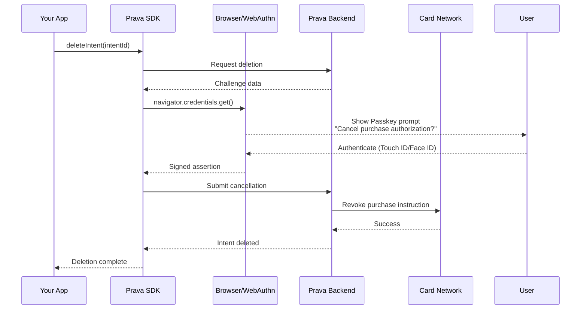

## Overview

The `deleteIntent()` method cancels a registered purchase intent. This operation **requires Passkey authentication** to prevent unauthorized cancellation.

<Warning>
This action is **irreversible**. Once deleted, the intent and any generated credentials become invalid immediately.
</Warning>

## Method Signature

```typescript
prava.deleteIntent(intentId: string): Promise<void>
```

## Parameters

<ParamField path="intentId" type="string" required>
  Intent identifier from `registerIntent()` response
</ParamField>

## Return Value

Returns a `Promise<void>` that resolves when the intent is successfully deleted.

## Example

<CodeGroup>
```typescript React
import { useState } from 'react';
import { PravaSDK } from '@prava-sdk/core';

function IntentManager({ intent }) {
  const [deleting, setDeleting] = useState(false);

  const prava = new PravaSDK({
    publishableKey: 'pk_sandbox_your_key',
    environment: 'sandbox'
  });

  async function handleDelete() {
    if (!confirm(`Cancel purchase authorization for ${intent.merchantName}?`)) {
      return;
    }

    setDeleting(true);

    try {
      // This triggers Passkey authentication
      await prava.deleteIntent(intent.intentId);
      alert('Intent cancelled successfully');
      onIntentDeleted(intent.intentId);
    } catch (error) {
      if (error.code === 'PASSKEY_CANCELLED') {
        alert('Cancellation cancelled');
      } else {
        alert(`Failed to cancel: ${error.message}`);
      }
    } finally {
      setDeleting(false);
    }
  }

  return (
    <div className="intent-card">
      <h3>{intent.merchantName}</h3>
      <p>Max: ${intent.declineThreshold.amount}</p>
      <p>Expires: {new Date(intent.expiresAt).toLocaleDateString()}</p>
      <button 
        onClick={handleDelete}
        disabled={deleting}
        className="btn-danger"
      >
        {deleting ? 'Cancelling...' : 'Cancel Authorization'}
      </button>
    </div>
  );
}
```

```typescript Node.js
const prava = new PravaSDK({
  publishableKey: 'pk_sandbox_your_key',
  environment: 'sandbox'
});

// Delete an intent
try {
  await prava.deleteIntent('intent_abc123');
  console.log('Intent cancelled successfully');
} catch (error) {
  if (error.code === 'PASSKEY_CANCELLED') {
    console.log('User cancelled the cancellation');
  } else {
    console.error('Failed to delete intent:', error);
  }
}
```
</CodeGroup>

## Passkey Authentication Flow



<Note>
The Passkey prompt will show which purchase authorization is being cancelled (merchant name, amount, products).
</Note>

## Use Cases

### User-Initiated Cancellation

Let users cancel purchase authorizations they no longer want:

```typescript
function ActiveIntentsList() {
  const [intents, setIntents] = useState([]);

  async function handleCancel(intentId: string) {
    try {
      await prava.deleteIntent(intentId);
      setIntents(intents.filter(i => i.intentId !== intentId));
      toast.success('Authorization cancelled');
    } catch (error) {
      if (error.code === 'PASSKEY_CANCELLED') {
        // User changed their mind, do nothing
        return;
      }
      toast.error(`Failed to cancel: ${error.message}`);
    }
  }

  return (
    <div>
      <h2>Active Authorizations</h2>
      {intents.map(intent => (
        <IntentCard
          key={intent.intentId}
          intent={intent}
          onCancel={() => handleCancel(intent.intentId)}
        />
      ))}
    </div>
  );
}
```

### Expired Intent Cleanup

Automatically clean up expired intents:

```typescript
async function cleanupExpiredIntents(userId: string) {
  const intents = await getActiveIntents(userId);
  const now = new Date();

  const expiredIntents = intents.filter(intent => {
    return new Date(intent.expiresAt) < now;
  });

  if (expiredIntents.length === 0) {
    return { cleaned: 0 };
  }

  const results = await Promise.allSettled(
    expiredIntents.map(intent => prava.deleteIntent(intent.intentId))
  );

  const deleted = results.filter(r => r.status === 'fulfilled').length;
  const failed = results.filter(r => r.status === 'rejected').length;

  return { cleaned: deleted, failed };
}
```

### Cancel Before Alternative Payment Method

Allow users to switch payment methods:

```typescript
async function switchToNewCard(intentId: string, newCardId: string) {
  const currentIntent = await prava.getIntent(intentId);

  try {
    // 1. Delete old intent
    await prava.deleteIntent(intentId);

    // 2. Create new intent with new card
    const newIntent = await prava.registerIntent({
      cardId: newCardId,
      merchantName: currentIntent.merchantName,
      merchantUrl: currentIntent.merchantUrl,
      declineThreshold: currentIntent.declineThreshold,
      effectiveUntilTime: currentIntent.effectiveUntilTime,
      products: currentIntent.products,
      consumerPrompt: currentIntent.consumerPrompt
    });

    return { success: true, newIntentId: newIntent.intentId };
  } catch (error) {
    if (error.code === 'PASSKEY_CANCELLED') {
      // User cancelled, old intent still valid
      return { success: false, cancelled: true };
    }
    throw error;
  }
}
```

### Timeout/Abandon Cleanup

Clean up intents for abandoned checkouts:

```typescript
async function handleCheckoutAbandoned(intentId: string, reason: string) {
  try {
    await prava.deleteIntent(intentId);
    
    // Log the abandonment
    await analytics.track('checkout_abandoned', {
      intentId,
      reason,
      timestamp: new Date().toISOString()
    });

    return { cleaned: true };
  } catch (error) {
    console.error('Failed to clean up abandoned intent:', error);
    // Intent will expire naturally
    return { cleaned: false };
  }
}

// Use with checkout timeout
const CHECKOUT_TIMEOUT = 15 * 60 * 1000; // 15 minutes

setTimeout(() => {
  handleCheckoutAbandoned(intentId, 'timeout');
}, CHECKOUT_TIMEOUT);
```

## Error Handling

<ResponseField name="error" type="PravaError">
  <Expandable title="properties">
    <ResponseField name="code" type="string">
      Error code
    </ResponseField>

    <ResponseField name="message" type="string">
      Error description
    </ResponseField>
  </Expandable>
</ResponseField>

### Common Errors

| Code | Cause | Resolution |
|------|-------|------------|
| `INTENT_NOT_FOUND` | Intent ID doesn't exist or already deleted | Verify intentId |
| `INTENT_ALREADY_USED` | Credentials were already used for payment | Cannot cancel completed purchase |
| `PASSKEY_CANCELLED` | User cancelled deletion | Allow retry |
| `PASSKEY_FAILED` | Biometric verification failed | Ask user to retry |
| `PASSKEY_NOT_AVAILABLE` | Device doesn't support Passkey | Use fallback method |

## Deletion States

### Intent States

```typescript
// States an intent can be in
type IntentStatus = 
  | 'registered'  // Created and authenticated
  | 'invoked'     // Credentials generated
  | 'used'        // Payment completed
  | 'expired'     // Passed effectiveUntilTime
  | 'deleted';    // Cancelled by user

// Can delete in these states:
// ✅ registered - Intent exists but not yet invoked
// ✅ invoked - Credentials generated but not used yet
// ❌ used - Payment completed, cannot cancel
// ✅ expired - Can delete for cleanup
```

### State Checking

```typescript
async function canDeleteIntent(intentId: string): Promise<boolean> {
  try {
    const intent = await prava.getIntent(intentId);
    
    // Cannot delete if already used
    if (intent.status === 'used') {
      return false;
    }

    // Can delete all other states
    return true;
  } catch (error) {
    if (error.code === 'INTENT_NOT_FOUND') {
      return false;
    }
    throw error;
  }
}

// Use before attempting deletion
if (await canDeleteIntent(intentId)) {
  await prava.deleteIntent(intentId);
} else {
  console.log('Cannot delete: payment already completed');
}
```

## Bulk Deletion

Delete multiple intents (requires Passkey for each):

```typescript
async function deleteMultipleIntents(intentIds: string[]) {
  const results = {
    deleted: [] as string[],
    failed: [] as { intentId: string; error: string }[],
    cancelled: [] as string[]
  };

  for (const intentId of intentIds) {
    try {
      await prava.deleteIntent(intentId);
      results.deleted.push(intentId);
    } catch (error) {
      if (error.code === 'PASSKEY_CANCELLED') {
        results.cancelled.push(intentId);
        // User cancelled, stop trying to delete more
        break;
      } else {
        results.failed.push({
          intentId,
          error: error.message
        });
      }
    }
  }

  return results;
}
```

## Audit Logging

Track intent deletions for compliance:

```typescript
await prava.deleteIntent(intentId, {
  reason: 'User requested cancellation',
  metadata: {
    userId: 'user_123',
    timestamp: new Date().toISOString(),
    source: 'web_app'
  }
});

// Common deletion reasons:
// - 'user_requested': User manually cancelled
// - 'checkout_abandoned': Checkout timeout
// - 'card_changed': Switched to different card
// - 'expired_cleanup': Automatic cleanup
// - 'security_revocation': Security incident
```

## Security Considerations

<Warning>
**Passkey required**: Unlike read operations, deletion always requires Passkey authentication to prevent unauthorized cancellation.
</Warning>

<Note>
**Immediate effect**: Deletion takes effect immediately. Any credentials generated from this intent become invalid at the same moment.
</Note>

<Tip>
**Cannot undo**: There is no "undelete" operation. If a user accidentally cancels, they must create a new intent with Passkey authentication.
</Tip>

## Testing in Sandbox

```typescript
const prava = new PravaSDK({
  publishableKey: 'pk_sandbox_your_key',
  environment: 'sandbox'  // Uses mock Passkey in sandbox
});

// Sandbox: Deletion uses test authentication
await prava.deleteIntent('intent_test_123');
```

## Next Steps

<CardGroup cols={2}>
<Card title="Register Intent" icon="bolt" href="/sdk/intents/register">
  Create a new purchase authorization
</Card>

<Card title="List Cards" icon="list" href="/sdk/cards/list-cards">
  Manage enrolled payment methods
</Card>
</CardGroup>
