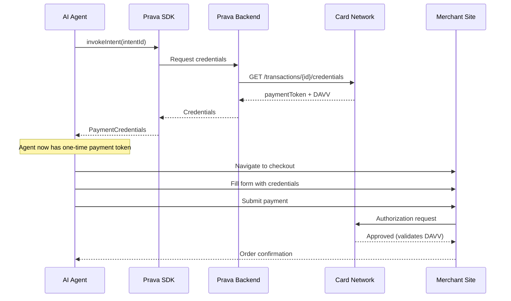

## Overview

The `invokeIntent()` method retrieves payment credentials (tokenized card number, expiration, and dynamic cryptogram) from a previously registered intent. These credentials are single-use and scoped to the specific merchant and amount.

<Note>
**No additional authentication required**: If the intent was already authorized with Passkey during registration, invoking it does not trigger another authentication prompt.
</Note>

## Method Signature

```typescript
prava.invokeIntent(intentId: string): Promise<PaymentCredentials>
```

## Parameters

<ParamField path="intentId" type="string" required>
  Intent identifier from `registerIntent()` response
</ParamField>

## Return Value

<ResponseField name="credentials" type="PaymentCredentials">
  <Expandable title="properties">
    <ResponseField name="paymentToken" type="string">
      Tokenized card number (DPAN) - use this as the card number at checkout
    </ResponseField>

    <ResponseField name="tokenExpiration" type="object">
      Token expiration date
      
      <Expandable title="properties">
        <ResponseField name="month" type="string">
          Expiration month (2 digits, e.g., "12")
        </ResponseField>

        <ResponseField name="year" type="string">
          Expiration year (4 digits, e.g., "2028")
        </ResponseField>
      </Expandable>
    </ResponseField>

    <ResponseField name="dynamicDataValue" type="string">
      Single-use CVV/cryptogram (DAVV) - use this as CVV at checkout
    </ResponseField>

    <ResponseField name="dynamicDataId" type="string">
      Identifier for this credential set (used for transaction confirmation)
    </ResponseField>

    <ResponseField name="transactionId" type="string">
      Card network transaction identifier
    </ResponseField>
  </Expandable>
</ResponseField>

## Example

<CodeGroup>
```typescript AI Agent with Playwright
import { PravaSDK } from '@prava-sdk/core';
import { chromium } from 'playwright';

const prava = new PravaSDK({
  publishableKey: 'pk_sandbox_your_key',
  environment: 'sandbox'
});

async function executePurchase(intentId: string, checkoutUrl: string) {
  // 1. Get payment credentials
  const credentials = await prava.invokeIntent(intentId);

  // 2. Launch browser
  const browser = await chromium.launch({ headless: true });
  const page = await browser.newPage();

  // 3. Navigate to checkout
  await page.goto(checkoutUrl);

  // 4. Fill payment form
  await page.fill('[name="cardNumber"]', credentials.paymentToken);
  await page.fill('[name="expMonth"]', credentials.tokenExpiration.month);
  await page.fill('[name="expYear"]', credentials.tokenExpiration.year);
  await page.fill('[name="cvv"]', credentials.dynamicDataValue);

  // 5. Submit
  await page.click('button[type="submit"]');
  await page.waitForNavigation();

  // 6. Confirm success
  const success = await page.locator('.order-confirmation').isVisible();

  await browser.close();

  return { success, transactionId: credentials.transactionId };
}
```

```typescript React Component
function CheckoutExecution({ intentId }) {
  const [credentials, setCredentials] = useState(null);
  const [loading, setLoading] = useState(false);

  async function handleInvoke() {
    setLoading(true);

    try {
      const creds = await prava.invokeIntent(intentId);
      setCredentials(creds);

      // Now pass credentials to your checkout automation
      // or display them for manual entry (testing only)
    } catch (error) {
      alert(`Failed to get credentials: ${error.message}`);
    } finally {
      setLoading(false);
    }
  }

  return (
    <div>
      <h2>Execute Payment</h2>
      {!credentials ? (
        <button onClick={handleInvoke} disabled={loading}>
          {loading ? 'Generating Credentials...' : 'Get Payment Credentials'}
        </button>
      ) : (
        <div className="credentials">
          <p>✅ Credentials generated!</p>
          <code>
            Card: {credentials.paymentToken}<br/>
            Exp: {credentials.tokenExpiration.month}/{credentials.tokenExpiration.year}<br/>
            CVV: {credentials.dynamicDataValue}
          </code>
          <p>⚠️ These credentials are single-use and expire in 30 minutes.</p>
        </div>
      )}
    </div>
  );
}
```
</CodeGroup>

## Flow Diagram



## Credential Properties Explained

### Payment Token (DPAN)
The `paymentToken` is a **Device Primary Account Number** - a tokenized version of the user's real card number that:
- Looks like a real card number (16 digits, passes Luhn check)
- Is specific to this device, user, and merchant
- Cannot be used at other merchants
- Is valid for the `effectiveUntilTime` specified during intent registration

### Dynamic Data Value (DAVV)
The `dynamicDataValue` is a **single-use cryptogram** that:
- Acts like a CVV but changes with every invocation
- Is validated by the card network at authorization time
- Expires after one use or 30 minutes (whichever comes first)
- Is bound to the specific transaction amount and merchant

<Warning>
**Single-use only**: Once you invoke an intent, the credentials can be used exactly **once**. If checkout fails, you must register a new intent.
</Warning>

## Use Cases

### One-Time Purchase

```typescript
// User authorizes purchase
const intent = await prava.registerIntent({
  cardId: 'card_123',
  merchantName: 'Amazon',
  declineThreshold: { amount: 99.99, currency: 'USD' },
  effectiveUntilTime: new Date(Date.now() + 60 * 60 * 1000).toISOString(), // 1 hour
  consumerPrompt: 'Wireless headphones for $99.99'
});

// Agent executes immediately
const credentials = await prava.invokeIntent(intent.intentId);
await automateCheckout(credentials);
```

### Scheduled/Delayed Purchase

```typescript
// User authorizes purchase for later
const intent = await prava.registerIntent({
  cardId: 'card_123',
  merchantName: 'Grocery Store',
  declineThreshold: { amount: 150, currency: 'USD' },
  effectiveUntilTime: new Date('2024-12-31').toISOString(), // Valid until end of day
  consumerPrompt: 'Grocery delivery up to $150'
});

// Store intentId in database
await db.schedules.create({
  userId: 'user_123',
  intentId: intent.intentId,
  scheduledFor: '2024-12-31T18:00:00Z'
});

// Later, when scheduled time arrives
const credentials = await prava.invokeIntent(intent.intentId);
await placeGroceryOrder(credentials);
```

### Fallback Handling

```typescript
async function executePurchaseWithRetry(intentId: string, maxRetries = 2) {
  let attempts = 0;

  while (attempts < maxRetries) {
    try {
      const credentials = await prava.invokeIntent(intentId);
      const result = await automateCheckout(credentials);

      if (result.success) {
        return result;
      }

      // Checkout failed but didn't throw
      attempts++;
      if (attempts < maxRetries) {
        // Credentials are now invalid, need new intent
        throw new Error('Checkout failed, need new intent');
      }
    } catch (error) {
      if (error.code === 'CREDENTIALS_EXPIRED') {
        // Intent expired, ask user to reauthorize
        throw new Error('Purchase authorization expired');
      }

      if (error.code === 'CREDENTIALS_ALREADY_USED') {
        // Already invoked, cannot retry
        throw new Error('Payment credentials already used');
      }

      attempts++;
      if (attempts >= maxRetries) {
        throw error;
      }
    }
  }
}
```

## Error Handling

<ResponseField name="error" type="PravaError">
  <Expandable title="properties">
    <ResponseField name="code" type="string">
      Error code
    </ResponseField>

    <ResponseField name="message" type="string">
      Error description
    </ResponseField>
  </Expandable>
</ResponseField>

### Common Errors

| Code | Cause | Resolution |
|------|-------|------------|
| `INTENT_NOT_FOUND` | Intent ID doesn't exist | Verify intentId |
| `INTENT_EXPIRED` | Intent passed `effectiveUntilTime` | Register new intent |
| `INTENT_NOT_REGISTERED` | Intent not yet authorized with Passkey | Call `registerIntent()` first |
| `CREDENTIALS_ALREADY_USED` | Intent already invoked | Register new intent |
| `CREDENTIALS_EXPIRED` | Credentials generated but expired (30 min) | Re-invoke (if within intent validity) |
| `AMOUNT_EXCEEDED` | Actual merchant amount > decline threshold | Register new intent with higher amount |

## Security Considerations

<Warning>
**Never log or store credentials**: The payment token and DAVV are sensitive. Never write them to logs, databases, or error messages.
</Warning>

<Note>
**Credentials are merchant-specific**: The network validates that the merchant receiving the payment matches the `merchantName`/`merchantUrl` from the intent. Mismatches will be declined.
</Note>

<Tip>
**30-minute window**: After invoking, you have 30 minutes to use the credentials. Plan your checkout automation to complete within this time.
</Tip>

## Testing in Sandbox

In sandbox mode, you can invoke intents multiple times for testing:

```typescript
const prava = new PravaSDK({
  publishableKey: 'pk_sandbox_your_key',
  environment: 'sandbox'  // Allows multiple invokes
});

// Sandbox: Can invoke multiple times
const credentials1 = await prava.invokeIntent(intentId);
const credentials2 = await prava.invokeIntent(intentId); // Works in sandbox

// Production: Second invoke would fail with CREDENTIALS_ALREADY_USED
```

## Credential Expiration

```typescript
// Check if credentials are still valid
function isCredentialValid(credentials: PaymentCredentials) {
  const generatedAt = new Date(credentials.generatedAt);
  const expiresAt = new Date(generatedAt.getTime() + 30 * 60 * 1000); // 30 min
  return new Date() < expiresAt;
}

// Use credentials before expiration
const credentials = await prava.invokeIntent(intentId);

if (isCredentialValid(credentials)) {
  await automateCheckout(credentials);
} else {
  console.error('Credentials expired before use');
  // Re-invoke if within intent validity period
}
```

## Next Steps

<CardGroup cols={2}>
<Card title="Browser Automation" icon="robot" href="/sdk/execution/browser-automation">
  Execute checkout with Playwright/Puppeteer
</Card>

<Card title="Update Intent" icon="pen" href="/sdk/intents/update">
  Modify intent amount or expiration
</Card>
</CardGroup>
