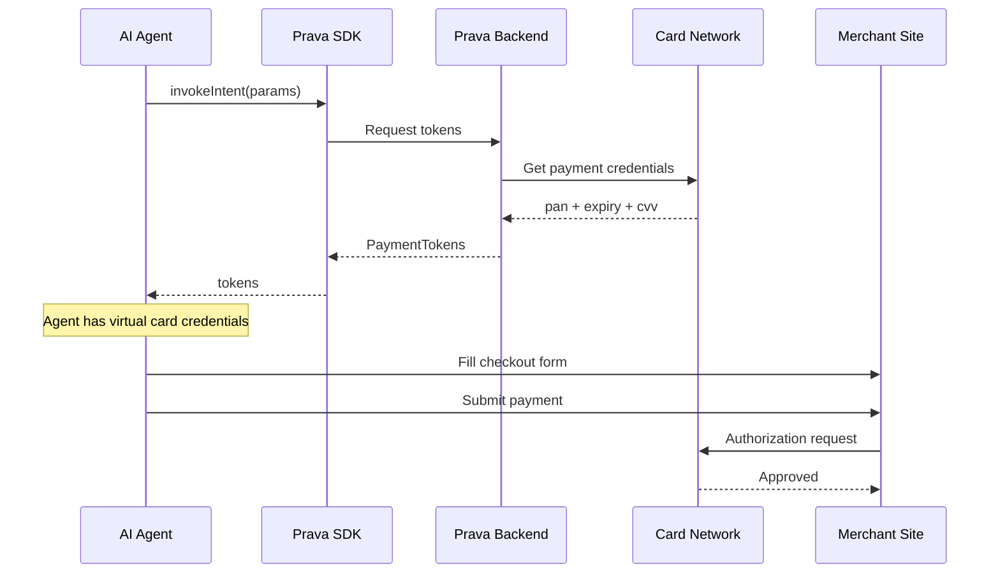

## Overview

The `invokeIntent()` method generates payment tokens (virtual card number, expiry, and CVV) from a previously registered intent. These are single-use credentials scoped to the mandate constraints — right merchant, right amount range, right time window.

<Note>
**No additional authentication required**: The intent was already authorized with Passkey during registration. Invoking does not trigger another prompt.
</Note>

## Method Signature

```typescript
prava.invokeIntent(params: InvokeIntentParams): Promise<PaymentTokens>
```

## Parameters

<ParamField path="params" type="InvokeIntentParams" required>
  <Expandable title="properties">
    <ParamField path="intentId" type="string" required>
      The intent ID from `registerIntent()`
    </ParamField>

    <ParamField path="merchant" type="string" required>
      Merchant name (must match the registered intent)
    </ParamField>

    <ParamField path="amount" type="number" required>
      Transaction amount (must be ≤ registered amount)
    </ParamField>

    <ParamField path="itemCount" type="number">
      Number of items
    </ParamField>
  </Expandable>
</ParamField>

## Return Value

<ResponseField name="tokens" type="PaymentTokens">
  <Expandable title="properties">
    <ResponseField name="pan" type="string">
      Virtual card number for checkout
    </ResponseField>

    <ResponseField name="expMonth" type="number">
      Expiration month
    </ResponseField>

    <ResponseField name="expYear" type="number">
      Expiration year
    </ResponseField>

    <ResponseField name="cvv" type="string">
      Single-use CVV
    </ResponseField>
  </Expandable>
</ResponseField>

## Example

<CodeGroup>
```typescript AI Agent
import { PravaSDK } from '@prava-sdk/core';

const prava = new PravaSDK({ publishableKey: 'pk_live_xxx' });

const tokens = await prava.invokeIntent({
  intentId: 'int_m7kx9...',
  merchant: 'Uber Eats',
  amount: 22.50,
  itemCount: 1,
});

// Use these tokens to complete the purchase
console.log(tokens.pan);       // "4811 7293 0012 3456" (virtual card number)
console.log(tokens.expMonth);  // 2
console.log(tokens.expYear);   // 28
console.log(tokens.cvv);       // "491"
```

```typescript Checkout Automation
import { PravaSDK } from '@prava-sdk/core';
import { chromium } from 'playwright';

const prava = new PravaSDK({ publishableKey: 'pk_live_xxx' });

async function executePurchase(intentId: string, checkoutUrl: string) {
  // 1. Get payment tokens
  const tokens = await prava.invokeIntent({
    intentId,
    merchant: 'Amazon',
    amount: 49.99,
    itemCount: 1,
  });

  // 2. Use tokens at checkout
  const browser = await chromium.launch({ headless: true });
  const page = await browser.newPage();
  await page.goto(checkoutUrl);

  await page.fill('[name="cardNumber"]', tokens.pan);
  await page.fill('[name="expMonth"]', String(tokens.expMonth));
  await page.fill('[name="expYear"]', String(tokens.expYear));
  await page.fill('[name="cvv"]', tokens.cvv);

  await page.click('button[type="submit"]');
  await browser.close();
}
```
</CodeGroup>

## Flow Diagram



## Payment Tokens Explained

**Payment Tokens** are single-use virtual card credentials generated from the card network. They're scoped to the mandate constraints — right merchant, right amount range, right time window. If anything is out of bounds, the invocation fails.

| Field | What it is |
|-------|-----------|
| `pan` | Virtual card number — use as card number at checkout |
| `expMonth` / `expYear` | Token expiration date |
| `cvv` | Single-use CVV — changes with every invocation |

<Warning>
**Single-use only**: Payment tokens can be used exactly **once**. If checkout fails, you must invoke the intent again (if `useLimit` allows).
</Warning>

## Error Handling

| Code | Cause | Resolution |
|------|-------|------------|
| `INTENT_EXPIRED` | Intent past its `expiresAt` date | Register a new intent |
| `INTENT_LIMIT_REACHED` | `useLimit` exhausted | Register a new intent |
| `MANDATE_VIOLATION` | Amount/merchant doesn't match mandate | Check intent constraints |
| `CARD_NOT_FOUND` | Card was removed | Re-enroll card and create new intent |

## Security Considerations

<Warning>
**Never log or store payment tokens**: Even though the agent creds are scoped still the `pan` and `cvv` are sensitive. best practice is to not write them to logs, databases, or error messages.
</Warning>

<Note>
**Tokens are merchant-specific**: The card network validates that the merchant receiving the payment matches the mandate. Mismatches will be declined.
</Note>

## Next Steps

<CardGroup cols={2}>
<Card title="Browser Automation" icon="robot" href="/sdk/execution/browser-automation">
  Execute checkout with tokens
</Card>

<Card title="Update Intent" icon="pen" href="/sdk/intents/update">
  Modify intent amount or limits
</Card>
</CardGroup>
