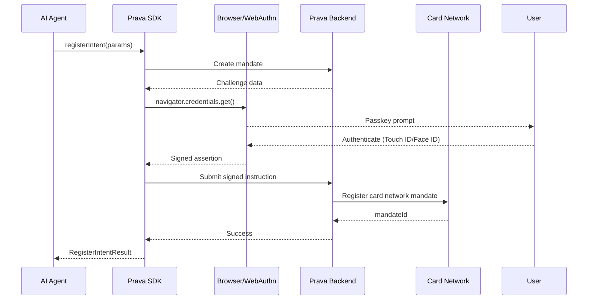

## Overview

The `registerIntent()` method registers a payment intent (mandate). Internally it maps the merchant to an MCC code, generates a card network mandate, and prompts the user to approve via passkey.

Returns an `intentId` that the AI App uses to invoke purchases — immediately, on a schedule, or recurring.

<Note>
**Requires Passkey**: This method triggers biometric/device authentication to ensure the user explicitly authorizes the purchase.
</Note>

## Method Signature

```typescript
prava.registerIntent(params: RegisterIntentParams): Promise<RegisterIntentResult>
```

## Parameters

<ParamField path="params" type="RegisterIntentParams" required>
  <Expandable title="properties">
    <ParamField path="cardId" type="string" required>
      Card to charge (from `collectPAN()` or `listCards()`)
    </ParamField>

    <ParamField path="merchant" type="string" required>
      Merchant name (mapped to MCC internally by Prava's merchant directory)
    </ParamField>

    <ParamField path="amount" type="number" required>
      Transaction amount
    </ParamField>

    <ParamField path="currency" type="string" required>
      ISO 4217 currency code (`USD`, `EUR`, etc.)
    </ParamField>

    <ParamField path="itemCount" type="number">
      Number of items
    </ParamField>

    <ParamField path="productUrl" type="string">
      URL of the product/service
    </ParamField>

    <ParamField path="useLimit" type="number">
      Max number of times this intent can be invoked. `1` = one-time, omit = unlimited
    </ParamField>

    <ParamField path="frequency" type="string">
      `one-time` · `daily` · `weekly` · `monthly` — for recurring intents
    </ParamField>

    <ParamField path="expiresAt" type="string">
      ISO 8601 expiry. Intent cannot be invoked after this date
    </ParamField>
  </Expandable>
</ParamField>

## Return Value

<ResponseField name="result" type="RegisterIntentResult">
  <Expandable title="properties">
    <ResponseField name="intentId" type="string">
      Unique identifier for this intent
    </ResponseField>

    <ResponseField name="status" type="string">
      `approved` or `rejected`
    </ResponseField>

    <ResponseField name="mcc" type="string">
      Resolved Merchant Category Code (e.g., `"5812"`)
    </ResponseField>

    <ResponseField name="mandateId" type="string">
      Internal card network mandate reference
    </ResponseField>

    <ResponseField name="createdAt" type="string">
      ISO 8601 timestamp
    </ResponseField>
  </Expandable>
</ResponseField>

## Example

<CodeGroup>
```typescript AI Agent
import { PravaSDK } from '@prava-sdk/core';

const prava = new PravaSDK({ publishableKey: 'pk_live_xxx' });

// User says: "Order me food from Uber Eats every week"
const intent = await prava.registerIntent({
  cardId: 'enr_abc123',
  merchant: 'Uber Eats',
  amount: 25.00,
  currency: 'USD',
  itemCount: 1,
  productUrl: 'https://ubereats.com/order/xyz',
  useLimit: 5,
  frequency: 'weekly',
});

console.log(intent.intentId);  // "int_m7kx9..."
console.log(intent.status);    // "approved"
console.log(intent.mcc);       // "5812" (Eating Places, Restaurants)
```

```typescript React Component
function PurchaseConfirmation({ product, cardId }) {
  const [loading, setLoading] = useState(false);
  const prava = new PravaSDK({ publishableKey: 'pk_live_xxx' });

  async function handleAuthorize() {
    setLoading(true);
    try {
      const intent = await prava.registerIntent({
        cardId,
        merchant: product.merchant,
        amount: product.price,
        currency: 'USD',
        itemCount: 1,
        productUrl: product.url,
        useLimit: 1,
      });

      // Navigate to execution step
      router.push(`/checkout/${intent.intentId}`);
    } catch (error) {
      if (error.code === 'PASSKEY_REJECTED') {
        alert('Authorization cancelled');
      } else {
        alert(`Authorization failed: ${error.message}`);
      }
    } finally {
      setLoading(false);
    }
  }

  return (
    <div>
      <h2>Authorize Purchase</h2>
      <p>{product.name} — ${product.price}</p>
      <button onClick={handleAuthorize} disabled={loading}>
        {loading ? 'Authenticating...' : 'Authorize with Passkey'}
      </button>
    </div>
  );
}
```
</CodeGroup>

## Under the Hood

When you call `registerIntent()`:

<Steps>
<Step title="Merchant Resolution">
SDK resolves the merchant name → MCC code via Prava's merchant directory.
</Step>

<Step title="Mandate Generation">
A card network mandate is generated with the specified constraints (amount, merchant, frequency, limits).
</Step>

<Step title="Passkey Prompt">
The user's device triggers a **passkey prompt** (WebAuthn) for biometric/device confirmation.
</Step>

<Step title="Mandate Activation">
On approval, the mandate is activated with the card network.
</Step>

<Step title="Result">
The `intentId` is returned — your AI App stores this to invoke later.
</Step>
</Steps>

## Passkey Authentication Flow



## Error Handling

| Code | Cause | Resolution |
|------|-------|------------|
| `PASSKEY_REJECTED` | User declined the passkey prompt | Allow retry |
| `PASSKEY_UNAVAILABLE` | Device doesn't support WebAuthn | Inform user |
| `CARD_NOT_FOUND` | Card ID is invalid or removed | Refresh card list |
| `MANDATE_VIOLATION` | Amount/merchant doesn't match constraints | Check params |

## Best Practices

### Use Limits and Frequency

```typescript
// ✅ One-time purchase
await prava.registerIntent({
  cardId, merchant: 'Amazon', amount: 29.99, currency: 'USD',
  useLimit: 1,
});

// ✅ Weekly recurring (max 4 times)
await prava.registerIntent({
  cardId, merchant: 'DoorDash', amount: 50.00, currency: 'USD',
  useLimit: 4, frequency: 'weekly',
});

// ✅ Open-ended with expiry
await prava.registerIntent({
  cardId, merchant: 'Spotify', amount: 9.99, currency: 'USD',
  frequency: 'monthly',
  expiresAt: '2027-01-01T00:00:00Z',
});
```

<Tip>
For instant "Buy Now" flows where you don't need to store a mandate for later, use [`registerAndInvokeIntent()`](/sdk/intents/register-and-invoke) instead.
</Tip>

## Next Steps

<CardGroup cols={2}>
<Card title="Invoke Intent" icon="play" href="/sdk/intents/invoke">
  Generate payment tokens from intent
</Card>

<Card title="Register & Invoke" icon="zap" href="/sdk/intents/register-and-invoke">
  One-shot instant purchases
</Card>
</CardGroup>
