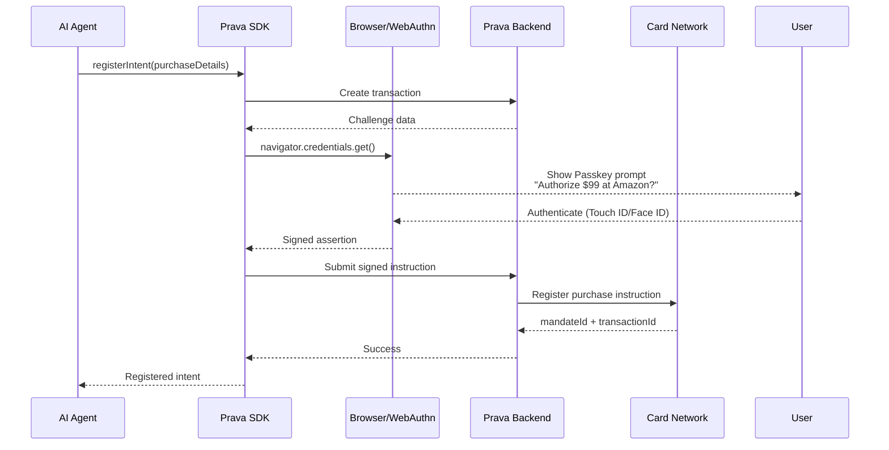

## Overview

The `registerIntent()` method creates a purchase instruction that the user authenticates with their Passkey. This intent acts as a permission for an AI agent to make a specific purchase on the user's behalf.

<Note>
**Requires Passkey**: This method always triggers biometric authentication to ensure the user explicitly authorizes the purchase.
</Note>

## Method Signature

```typescript
prava.registerIntent(intent: PurchaseIntent): Promise<RegisteredIntent>
```

## Parameters

<ParamField path="intent" type="PurchaseIntent" required>
  Purchase instruction details

  <Expandable title="properties">
    <ParamField path="cardId" type="string" required>
      ID of the enrolled card to use (from `listCards()`)
    </ParamField>

    <ParamField path="merchantName" type="string" required>
      Name of the merchant (e.g., "Amazon", "Nike Store")
    </ParamField>

    <ParamField path="merchantUrl" type="string">
      Merchant website URL for validation
    </ParamField>

    <ParamField path="merchantCategory" type="string">
      Human-readable category (e.g., "Electronics", "Clothing")
    </ParamField>

    <ParamField path="merchantCategoryCode" type="string">
      MCC code (e.g., "5732" for electronics stores)
    </ParamField>

    <ParamField path="declineThreshold" type="object" required>
      Maximum authorized amount
      
      <Expandable title="properties">
        <ParamField path="amount" type="number" required>
          Maximum amount in currency units
        </ParamField>

        <ParamField path="currency" type="string" required>
          ISO 4217 currency code (e.g., "USD")
        </ParamField>
      </Expandable>
    </ParamField>

    <ParamField path="effectiveUntilTime" type="string" required>
      ISO 8601 timestamp of when intent expires
    </ParamField>

    <ParamField path="products" type="array">
      List of items to purchase
      
      <Expandable title="Product properties">
        <ParamField path="name" type="string">
          Product name
        </ParamField>

        <ParamField path="url" type="string">
          Product page URL
        </ParamField>

        <ParamField path="quantity" type="number">
          Quantity to purchase
        </ParamField>

        <ParamField path="amount" type="number">
          Price per unit
        </ParamField>
      </Expandable>
    </ParamField>

    <ParamField path="consumerPrompt" type="string" required>
      Human-readable description shown during Passkey authentication
      (e.g., "Wireless earbuds under $100")
    </ParamField>

    <ParamField path="mandateId" type="string">
      Optional custom ID (auto-generated if not provided)
    </ParamField>
  </Expandable>
</ParamField>

## Return Value

<ResponseField name="result" type="RegisteredIntent">
  <Expandable title="properties">
    <ResponseField name="intentId" type="string">
      Unique identifier for this intent
    </ResponseField>

    <ResponseField name="mandateId" type="string">
      Mandate identifier (can be reused for recurring purchases)
    </ResponseField>

    <ResponseField name="status" type="string">
      Intent status (`registered`, `pending`, `expired`)
    </ResponseField>

    <ResponseField name="createdAt" type="string">
      ISO 8601 timestamp of registration
    </ResponseField>

    <ResponseField name="expiresAt" type="string">
      ISO 8601 timestamp of expiration
    </ResponseField>
  </Expandable>
</ResponseField>

## Example

<CodeGroup>
```typescript AI Agent
import { PravaSDK } from '@prava/sdk-core';

const prava = new PravaSDK({
  publishableKey: 'pk_sandbox_your_key',
  environment: 'sandbox'
});

// User says: "Buy me wireless earbuds under $100"
async function handlePurchaseRequest(userMessage: string) {
  // 1. Get user's cards
  const cards = await prava.listCards(sessionToken);
  const defaultCard = cards.find(c => c.is_default);

  if (!defaultCard) {
    return { error: 'No payment method available' };
  }

  // 2. Register intent (triggers Passkey)
  try {
    const intent = await prava.registerIntent({
      cardId: defaultCard.id,
      merchantName: 'Amazon',
      merchantUrl: 'https://amazon.com',
      merchantCategory: 'Electronics',
      merchantCategoryCode: '5732',
      declineThreshold: {
        amount: 100,
        currency: 'USD'
      },
      effectiveUntilTime: new Date(Date.now() + 24 * 60 * 60 * 1000).toISOString(), // 24 hours
      products: [
        {
          name: 'Wireless Earbuds',
          url: 'https://amazon.com/product/xyz',
          quantity: 1,
          amount: 79.99
        }
      ],
      consumerPrompt: 'Wireless earbuds under $100 from Amazon'
    });

    return {
      success: true,
      intentId: intent.intentId,
      message: 'Purchase authorized! Proceeding to checkout...'
    };
  } catch (error) {
    if (error.code === 'PASSKEY_CANCELLED') {
      return { error: 'User cancelled authorization' };
    }
    throw error;
  }
}
```

```typescript React Component
function PurchaseConfirmation({ product }) {
  const [loading, setLoading] = useState(false);

  async function handleAuthorize() {
    setLoading(true);

    try {
      const intent = await prava.registerIntent({
        cardId: selectedCard.id,
        merchantName: product.merchant,
        merchantUrl: product.merchantUrl,
        declineThreshold: {
          amount: product.price,
          currency: 'USD'
        },
        effectiveUntilTime: new Date(Date.now() + 60 * 60 * 1000).toISOString(), // 1 hour
        products: [
          {
            name: product.name,
            url: product.url,
            quantity: 1,
            amount: product.price
          }
        ],
        consumerPrompt: `${product.name} for $${product.price}`
      });

      // Navigate to execution step
      router.push(`/checkout/${intent.intentId}`);
    } catch (error) {
      alert(`Authorization failed: ${error.message}`);
    } finally {
      setLoading(false);
    }
  }

  return (
    <div>
      <h2>Authorize Purchase</h2>
      <p>{product.name}</p>
      <p>${product.price}</p>
      <button onClick={handleAuthorize} disabled={loading}>
        {loading ? 'Authenticating...' : 'Authorize with Passkey'}
      </button>
    </div>
  );
}
```
</CodeGroup>

## Passkey Authentication Flow



<Tip>
The Passkey prompt shows the `consumerPrompt` text, so make it clear and specific (e.g., "Wireless earbuds under $100" not just "Purchase").
</Tip>

## Under the Hood

When you call `registerIntent()`:

<Steps>
<Step title="Transaction Creation">
Prava creates a transaction record with all purchase details (amount, merchant, products).
</Step>

<Step title="Challenge Generation">
The backend generates a cryptographic challenge for WebAuthn.
</Step>

<Step title="Passkey Prompt">
The user sees a biometric prompt with the `consumerPrompt` text and must authenticate.
</Step>

<Step title="Signature Verification">
The signed assertion is verified to ensure it came from the registered device.
</Step>

<Step title="Card Network Registration">
Prava securely submits the authenticated instruction to the card network for registration.
</Step>

<Step title="Mandate Creation">
The card network returns identifiers that can be used to retrieve payment credentials later.
</Step>
</Steps>

## Intent Object Structure

The full intent object structure:

```typescript
interface PurchaseIntent {
  // Required
  cardId: string;
  merchantName: string;
  declineThreshold: {
    amount: number;
    currency: string;
  };
  effectiveUntilTime: string; // ISO 8601
  consumerPrompt: string;

  // Optional but recommended
  merchantUrl?: string;
  merchantCategory?: string;
  merchantCategoryCode?: string; // MCC

  // Optional
  products?: {
    name: string;
    url?: string;
    quantity?: number;
    amount?: number;
  }[];
  mandateId?: string; // Auto-generated if omitted
}
```

## Merchant Category Codes (MCC)

Common MCCs for scoping intents:

| MCC | Category | Example |
|-----|----------|---------|
| `5732` | Electronics Stores | Best Buy, Newegg |
| `5651` | Family Clothing Stores | Gap, H&M |
| `5411` | Grocery Stores | Whole Foods, Trader Joe's |
| `5812` | Eating Places, Restaurants | Chipotle, Starbucks |
| `5661` | Shoe Stores | Nike, Foot Locker |
| `5942` | Book Stores | Barnes & Noble, Amazon Books |

<Note>
MCCs are enforced at the network level. If the merchant's actual MCC doesn't match, the payment will be declined.
</Note>

## Error Handling

<ResponseField name="error" type="PravaError">
  <Expandable title="properties">
    <ResponseField name="code" type="string">
      Error code
    </ResponseField>

    <ResponseField name="message" type="string">
      Error description
    </ResponseField>
  </Expandable>
</ResponseField>

### Common Errors

| Code | Cause | Resolution |
|------|-------|------------|
| `PASSKEY_CANCELLED` | User cancelled authentication | Allow retry or cancel flow |
| `PASSKEY_FAILED` | Biometric verification failed | Ask user to retry |
| `CARD_NOT_FOUND` | Card ID is invalid | Refresh card list |
| `AMOUNT_EXCEEDS_LIMIT` | Amount exceeds card/account limit | Reduce amount or use different card |
| `MERCHANT_BLOCKED` | Merchant is on blocklist | Choose different merchant |
| `INVALID_MCC` | MCC doesn't match merchant | Verify MCC code |

## Best Practices

### 1. Clear Consumer Prompts

```typescript
// ✅ Good: Specific and clear
consumerPrompt: "Wireless Sony WH-1000XM5 headphones for $348"

// ❌ Bad: Too vague
consumerPrompt: "Purchase"
```

### 2. Reasonable Expiration Times

```typescript
// ✅ Good: Near-term purchase
effectiveUntilTime: new Date(Date.now() + 24 * 60 * 60 * 1000).toISOString() // 24 hours

// ⚠️ Caution: Long expiration (use for subscriptions only)
effectiveUntilTime: new Date(Date.now() + 30 * 24 * 60 * 60 * 1000).toISOString() // 30 days
```

### 3. Accurate Product Details

```typescript
// ✅ Good: Complete product information
products: [
  {
    name: 'Sony WH-1000XM5 Wireless Headphones',
    url: 'https://amazon.com/dp/B09XS7JWHH',
    quantity: 1,
    amount: 348.00
  }
]

// ❌ Bad: Missing details
products: [{ name: 'Headphones' }]
```

## Security Considerations

<Warning>
**Decline threshold is enforced by card network**: Even if an agent tries to exceed the authorized amount, the network will decline the transaction.
</Warning>

<Note>
**MCC scoping prevents misuse**: If you authorize electronics purchases, the credential cannot be used at restaurants or other categories.
</Note>

<Tip>
**Short expiration = less risk**: Use the minimum necessary expiration time. For immediate purchases, 1 hour is sufficient.
</Tip>

## Next Steps

<CardGroup cols={2}>
<Card title="Invoke Intent" icon="play" href="/sdk/intents/invoke">
  Generate payment credentials from intent
</Card>

<Card title="Browser Automation" icon="robot" href="/sdk/execution/browser-automation">
  Execute checkout with generated credentials
</Card>
</CardGroup>
