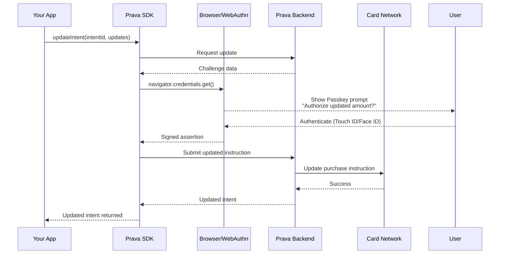

## Overview

The `updateIntent()` method modifies an existing purchase intent. This operation **requires Passkey authentication** to ensure the user explicitly approves the changes.

<Warning>
Updating an intent invalidates any previously generated credentials. If you already invoked the intent, you'll need to invoke it again after updating.
</Warning>

## Method Signature

```typescript
prava.updateIntent(intentId: string, updates: IntentUpdates): Promise<RegisteredIntent>
```

## Parameters

<ParamField path="intentId" type="string" required>
  Intent identifier from `registerIntent()` response
</ParamField>

<ParamField path="updates" type="IntentUpdates" required>
  Fields to update

  <Expandable title="properties">
    <ParamField path="declineThreshold" type="object">
      New maximum authorized amount
      
      <Expandable title="properties">
        <ParamField path="amount" type="number">
          New amount
        </ParamField>

        <ParamField path="currency" type="string">
          Currency code (must match original)
        </ParamField>
      </Expandable>
    </ParamField>

    <ParamField path="effectiveUntilTime" type="string">
      New expiration timestamp (ISO 8601)
    </ParamField>

    <ParamField path="products" type="array">
      Updated product list
    </ParamField>

    <ParamField path="consumerPrompt" type="string">
      Updated description for Passkey prompt
    </ParamField>
  </Expandable>
</ParamField>

## Return Value

<ResponseField name="result" type="RegisteredIntent">
  Updated intent with new `updatedAt` timestamp
</ResponseField>

## Example

<CodeGroup>
```typescript Increase Amount
const prava = new PravaSDK({
  publishableKey: 'pk_sandbox_your_key',
  environment: 'sandbox'
});

// Original intent: $100 max
const intent = await prava.registerIntent({
  cardId: 'card_123',
  merchantName: 'Amazon',
  declineThreshold: { amount: 100, currency: 'USD' },
  effectiveUntilTime: new Date(Date.now() + 24 * 60 * 60 * 1000).toISOString(),
  consumerPrompt: 'Headphones under $100'
});

// User finds better headphones for $149
// Update the intent (triggers Passkey)
const updated = await prava.updateIntent(intent.intentId, {
  declineThreshold: { amount: 150, currency: 'USD' },
  consumerPrompt: 'Sony WH-1000XM5 headphones for $149'
});

// Now agent can execute with new amount
const credentials = await prava.invokeIntent(updated.intentId);
```

```typescript Extend Expiration
// Intent expires in 1 hour
const intent = await prava.registerIntent({
  cardId: 'card_123',
  merchantName: 'Best Buy',
  declineThreshold: { amount: 200, currency: 'USD' },
  effectiveUntilTime: new Date(Date.now() + 60 * 60 * 1000).toISOString(), // 1 hour
  consumerPrompt: 'Laptop accessories up to $200'
});

// User needs more time to decide
// Extend expiration to 24 hours
const updated = await prava.updateIntent(intent.intentId, {
  effectiveUntilTime: new Date(Date.now() + 24 * 60 * 60 * 1000).toISOString()
});
```

```typescript Update Products
const intent = await prava.registerIntent({
  cardId: 'card_123',
  merchantName: 'Whole Foods',
  declineThreshold: { amount: 50, currency: 'USD' },
  effectiveUntilTime: new Date(Date.now() + 4 * 60 * 60 * 1000).toISOString(),
  products: [
    { name: 'Organic Bananas', quantity: 1, amount: 4.99 },
    { name: 'Almond Milk', quantity: 1, amount: 5.99 }
  ],
  consumerPrompt: 'Groceries up to $50'
});

// User adds more items
const updated = await prava.updateIntent(intent.intentId, {
  products: [
    { name: 'Organic Bananas', quantity: 1, amount: 4.99 },
    { name: 'Almond Milk', quantity: 1, amount: 5.99 },
    { name: 'Avocados', quantity: 3, amount: 9.99 },
    { name: 'Quinoa', quantity: 1, amount: 12.99 }
  ],
  consumerPrompt: 'Groceries up to $50'
});
```
</CodeGroup>

## Passkey Authentication Flow



<Note>
The Passkey prompt will show the **changes** being made (e.g., "Increase limit from $100 to $150").
</Note>

## What Can Be Updated?

### ✅ Allowed Updates
- **Decline Threshold**: Increase or decrease amount
- **Expiration Time**: Extend or shorten validity period
- **Products**: Add, remove, or modify product list
- **Consumer Prompt**: Update description

### ❌ Cannot Be Updated
- **Card**: Cannot switch to a different card (delete and create new instead)
- **Merchant**: Cannot change merchant (security restriction)
- **Merchant Category Code**: Cannot change MCC (security restriction)
- **Mandate ID**: Immutable identifier

## Use Cases

### Price Change at Checkout

```typescript
async function handlePriceIncrease(intentId: string, newPrice: number) {
  const currentIntent = await prava.getIntent(intentId);
  
  if (newPrice > currentIntent.declineThreshold.amount) {
    // Price went up, need to update
    try {
      const updated = await prava.updateIntent(intentId, {
        declineThreshold: {
          amount: newPrice + 5, // Add buffer for taxes/fees
          currency: 'USD'
        },
        consumerPrompt: `Updated price: $${newPrice} + taxes`
      });

      return { success: true, updated };
    } catch (error) {
      if (error.code === 'PASSKEY_CANCELLED') {
        return { success: false, reason: 'User declined price increase' };
      }
      throw error;
    }
  }

  return { success: true, noUpdateNeeded: true };
}
```

### Cart Modifications

```typescript
async function updateCart(intentId: string, cart: CartItem[]) {
  const totalAmount = cart.reduce((sum, item) => sum + (item.price * item.quantity), 0);

  const updated = await prava.updateIntent(intentId, {
    declineThreshold: {
      amount: totalAmount * 1.1, // 10% buffer
      currency: 'USD'
    },
    products: cart.map(item => ({
      name: item.name,
      url: item.url,
      quantity: item.quantity,
      amount: item.price
    })),
    consumerPrompt: `Cart total: $${totalAmount.toFixed(2)}`
  });

  return updated;
}
```

### Expiration Extension

```typescript
async function extendIntentValidity(intentId: string, additionalHours: number) {
  const currentIntent = await prava.getIntent(intentId);
  const currentExpiry = new Date(currentIntent.expiresAt);
  const newExpiry = new Date(currentExpiry.getTime() + additionalHours * 60 * 60 * 1000);

  try {
    const updated = await prava.updateIntent(intentId, {
      effectiveUntilTime: newExpiry.toISOString()
    });

    return {
      success: true,
      newExpiry: updated.expiresAt
    };
  } catch (error) {
    if (error.code === 'PASSKEY_CANCELLED') {
      return {
        success: false,
        reason: 'User declined extension'
      };
    }
    throw error;
  }
}
```

## Error Handling

<ResponseField name="error" type="PravaError">
  <Expandable title="properties">
    <ResponseField name="code" type="string">
      Error code
    </ResponseField>

    <ResponseField name="message" type="string">
      Error description
    </ResponseField>
  </Expandable>
</ResponseField>

### Common Errors

| Code | Cause | Resolution |
|------|-------|------------|
| `INTENT_NOT_FOUND` | Intent ID doesn't exist | Verify intentId |
| `INTENT_EXPIRED` | Intent already expired | Create new intent |
| `PASSKEY_CANCELLED` | User cancelled update | Allow retry or cancel |
| `PASSKEY_FAILED` | Biometric verification failed | Ask user to retry |
| `INVALID_AMOUNT` | Amount outside allowed range | Adjust amount |
| `INVALID_EXPIRATION` | Expiration in past or too far future | Use valid date range |
| `MERCHANT_CHANGE_NOT_ALLOWED` | Attempted to change merchant | Create new intent |

## Update Validation

The system validates updates to prevent security issues:

```typescript
// ✅ Valid updates
await prava.updateIntent(intentId, {
  declineThreshold: { amount: 150, currency: 'USD' } // Same currency
});

// ❌ Invalid: Cannot change currency
await prava.updateIntent(intentId, {
  declineThreshold: { amount: 100, currency: 'EUR' } // Different currency
});

// ✅ Valid: Extend expiration
await prava.updateIntent(intentId, {
  effectiveUntilTime: new Date(Date.now() + 48 * 60 * 60 * 1000).toISOString()
});

// ❌ Invalid: Expiration in the past
await prava.updateIntent(intentId, {
  effectiveUntilTime: new Date(Date.now() - 60 * 60 * 1000).toISOString()
});
```

## Partial Updates

You only need to provide the fields you want to change:

```typescript
// Update only amount
await prava.updateIntent(intentId, {
  declineThreshold: { amount: 200, currency: 'USD' }
});

// Update only expiration
await prava.updateIntent(intentId, {
  effectiveUntilTime: new Date(Date.now() + 12 * 60 * 60 * 1000).toISOString()
});

// Update both
await prava.updateIntent(intentId, {
  declineThreshold: { amount: 200, currency: 'USD' },
  effectiveUntilTime: new Date(Date.now() + 12 * 60 * 60 * 1000).toISOString()
});
```

## Credentials Invalidation

<Warning>
**Important**: Updating an intent invalidates any previously generated credentials. You must invoke the intent again after updating.
</Warning>

```typescript
// ❌ Wrong: Using old credentials after update
const credentials = await prava.invokeIntent(intentId);
await prava.updateIntent(intentId, { declineThreshold: { amount: 200, currency: 'USD' } });
await checkout(credentials); // These credentials are now invalid!

// ✅ Correct: Re-invoke after update
const oldCredentials = await prava.invokeIntent(intentId);
await prava.updateIntent(intentId, { declineThreshold: { amount: 200, currency: 'USD' } });
const newCredentials = await prava.invokeIntent(intentId);
await checkout(newCredentials);
```

## Security Considerations

<Note>
**Passkey required for all updates**: This ensures malicious actors cannot modify purchase authorizations without user consent.
</Note>

<Tip>
**Amount increases are logged**: All amount increases are recorded in audit logs and may trigger additional fraud checks.
</Tip>

## Next Steps

<CardGroup cols={2}>
<Card title="Delete Intent" icon="trash" href="/sdk/intents/delete">
  Cancel an intent before execution
</Card>

<Card title="Invoke Intent" icon="play" href="/sdk/intents/invoke">
  Generate credentials from updated intent
</Card>
</CardGroup>
