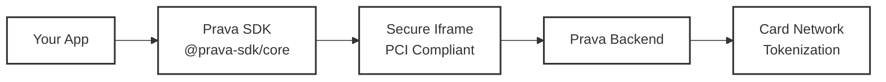

## What is the Prava SDK?

The Prava SDK provides a simple, secure interface for AI agents and applications to handle payments on behalf of users. It abstracts the complexity of card tokenization, intent management, passkey authentication, and checkout execution.

## Concepts

There are four primitives you need to understand:

| Primitive | What it is | One-liner |
|-----------|-----------|-----------|
| **Card** | A tokenized card enrolled via PCI-compliant iframe | Your servers never see the raw PAN. Ever. |
| **Intent** | A mandate that describes _what_ the AI can buy | Merchant, price, category, frequency — scoped and user-approved. |
| **Payment Token** | The transactable output (virtual PAN + expiry + CVV) | What your AI App actually uses to make a purchase. |
| **Passkey** | WebAuthn-based user approval | No passwords. Biometric/device confirmation for intents. |

### The Flow

```
1. User enrolls a card         →  collectPAN()
2. AI App registers an intent  →  registerIntent()           →  user approves via passkey
3. AI App invokes the intent   →  invokeIntent()             →  receives payment tokens
4. AI App transacts            →  uses tokens at checkout
```

For instant purchases, steps 2–3 collapse into a single call: `registerAndInvokeIntent()`.

## Key Features

- **Zero PCI Scope**: Card data never touches your servers
- **Intent-Based Permissions**: Users authorize specific purchases via Passkey
- **Network-Level Security**: Merchant-specific, amount-scoped credentials
- **Browser Automation Ready**: Built-in checkout execution helpers

## Installation

<CodeGroup>
```bash npm
npm install @prava-sdk/core
```

```bash yarn
yarn add @prava-sdk/core
```

```bash pnpm
pnpm add @prava-sdk/core
```
</CodeGroup>

## Quick Start

<Steps>
<Step title="Initialize the SDK">
Import and configure the SDK with your publishable key:

```typescript
import { PravaSDK } from '@prava-sdk/core';

const prava = new PravaSDK({
  publishableKey: 'pk_live_xxx', // from Prava Dashboard
});
```
</Step>

<Step title="Create a session and enroll a card">
Create a session server-side, then collect card data client-side:

```typescript
// Server-side: create a session
const session = await fetch('/api/create-session', {
  method: 'POST',
  headers: { 'Authorization': `Bearer ${SECRET_KEY}` },
  body: JSON.stringify({ user_id: 'user_123', user_email: 'user@example.com' }),
}).then(res => res.json());

// Client-side: collect card via secure iframe
const card = await prava.collectPAN({
  sessionToken: session.session_token,
  iframeUrl: session.iframe_url,
  container: '#card-form',
  onSuccess: (data) => console.log(`Enrolled: •••• ${data.last4}`),
});
```

```html
<div id="card-form"></div>
```
</Step>

<Step title="Register a payment intent">
```typescript
const intent = await prava.registerIntent({
  cardId: card.enrollmentId,
  merchant: 'Amazon',
  amount: 49.99,
  currency: 'USD',
  itemCount: 2,
  productUrl: 'https://amazon.com/dp/B0EXAMPLE',
  useLimit: 1,
});
// User is prompted to approve via passkey
```
</Step>

<Step title="Invoke the intent and get payment tokens">
```typescript
const tokens = await prava.invokeIntent({
  intentId: intent.intentId,
  merchant: 'Amazon',
  amount: 49.99,
  itemCount: 2,
});
// tokens.pan      → "4111 2345 6789 0123" (virtual)
// tokens.expiry   → "02/28"
// tokens.cvv      → "321"
```

Your AI App uses these tokens at checkout. Done.
</Step>
</Steps>

## SDK Architecture



## Authentication

The SDK uses a dual-key system:

| Key Type | Usage | Location |
|----------|-------|----------|
| **Publishable Key** (`pk_live_*` / `pk_test_*`) | Initialize SDK, client-side operations | Frontend |
| **Secret Key** (`sk_*`) | Create sessions, server operations | Backend only |

<Warning>
Never expose your secret key in client-side code or version control.
</Warning>

## Cleanup

When you're done with the SDK (e.g., component unmount), call `destroy()` to clean up:

```typescript
prava.destroy();
```

This removes the iframe, tears down PostMessage listeners, and releases all resources.

## Security Model

| Layer | Protection |
|-------|-----------|
| **Card Collection** | PCI DSS compliant iframe. Raw PAN never touches your DOM, JS, or servers. |
| **Iframe Sandbox** | `allow-scripts allow-same-origin allow-forms allow-popups`. Minimal permissions. |
| **Session Tokens** | Short-lived, single-use. Created server-side with your secret key. |
| **Passkeys (WebAuthn)** | All intent mutations (register, update, delete) require biometric/device confirmation. No passwords. |
| **Payment Tokens** | Virtual card numbers scoped to mandate constraints. Single-use, time-limited, merchant-locked. |
| **Origin Validation** | PostMessage communication is origin-locked. The iframe resolves its backend from its own hostname — merchants cannot inject a fake backend URL. |

## Requirements

- **Browser:** Chrome 80+, Firefox 80+, Safari 14+, Edge 80+
- **WebAuthn:** Device must support passkeys (Touch ID, Face ID, Windows Hello, or security key)
- **Backend:** Your server must implement the Prava session API (create sessions with your secret key)
- **Keys:** Obtain `publishableKey` and `secretKey` from the [Prava Dashboard](https://dashboard.prava.space)

## Error Codes

| Code | When | What to do |
|------|------|-----------|
| `SDK_ALREADY_ACTIVE` | `collectPAN` called while another session is active | Call `destroy()` first |
| `INVALID_CONFIG` | Missing `iframeUrl` or `publishableKey` | Check your config |
| `IFRAME_LOAD_ERROR` | Iframe failed to load | Check network, verify `iframeUrl` |
| `SDK_INIT_ERROR` | SDK initialization failed | Check browser compatibility |
| `PASSKEY_REJECTED` | User declined the passkey prompt | Prompt user to retry |
| `PASSKEY_UNAVAILABLE` | Device doesn't support WebAuthn | Fallback or inform user |
| `INTENT_EXPIRED` | Intent past its `expiresAt` date | Register a new intent |
| `INTENT_LIMIT_REACHED` | `useLimit` exhausted | Register a new intent |
| `MANDATE_VIOLATION` | Amount/merchant doesn't match mandate | Check intent constraints |
| `CARD_NOT_FOUND` | Card ID doesn't exist or was removed | Re-enroll or use a different card |

## Types

```typescript
interface CollectPANResult {
  enrollmentId: string;
  last4: string;
  brand: string;
  expMonth: number;
  expYear: number;
}

interface Card {
  cardId: string;
  last4: string;
  brand: string;
  expMonth: number;
  expYear: number;
  status: 'active' | 'expired' | 'removed';
}

interface RegisterIntentResult {
  intentId: string;
  status: 'approved' | 'rejected';
  mcc: string;
  mandateId: string;
  createdAt: string;
}

interface PaymentTokens {
  pan: string;
  expMonth: number;
  expYear: number;
  cvv: string;
}

interface UpdateIntentResult {
  intentId: string;
  status: 'updated';
  updatedFields: string[];
}

interface DeleteIntentResult {
  intentId: string;
  status: 'cancelled';
}

interface RemoveCardResult {
  cardId: string;
  status: 'removed';
}

interface CardValidationState {
  cardNumber: FieldState;
  expiry: FieldState;
  cvv: FieldState;
  isComplete: boolean;
}

interface FieldState {
  isEmpty: boolean;
  isValid: boolean;
  isFocused: boolean;
  error?: string;
}

interface PravaError {
  code: string;
  message: string;
  details?: Record<string, unknown>;
}
```

## Next Steps

<CardGroup cols={2}>
<Card title="Card Management" icon="credit-card" href="/sdk/cards/collect-pan">
  Learn how to collect and manage user cards
</Card>

<Card title="Intent Management" icon="bolt" href="/sdk/intents/register">
  Create and manage payment intents
</Card>

<Card title="Register & Invoke" icon="zap" href="/sdk/intents/register-and-invoke">
  One-shot instant purchases
</Card>

<Card title="Browser Automation" icon="robot" href="/sdk/execution/browser-automation">
  Execute payments at merchant checkouts
</Card>
</CardGroup>

## Support

- **Documentation**: [docs.prava.space](https://docs.prava.space)
- **Email**: developers@prava.space
